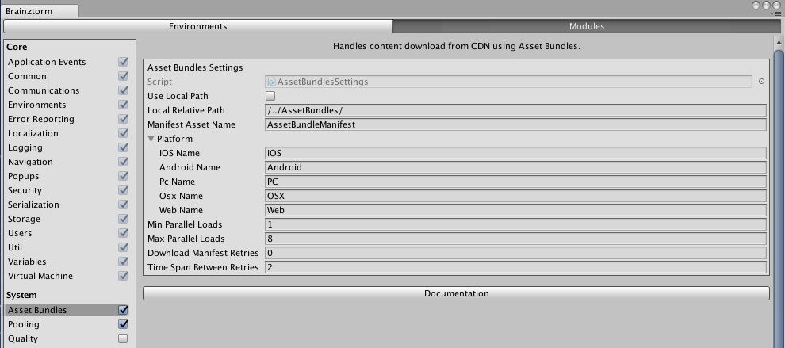

######################
AssetBundles Unity SDK
######################

`API Reference`_

**********
How to use
**********
For using this module, first you need activate it in `Brainztorm Settings Menu`_ 
and configure the neccesary attributes. See the image below:

.. note::

    For debugging purposes, it's recommended you activate the AssetBundles Log in the core 
    module Logging, through the `Brainztorm Settings Menu`_.

During the initialization phase, the module automatically fetch from the server 
the configuration to work with AssetBundles. If you activated the AssetBundles Logging, 
you can see the entire logs in Unity Console showing the initial request and response 
containing the :code:`GetAssetsOptions` type as follow:

.. code-block:: javascript

    //Request
    {
        "UUID": "<UUID>",
        "start": true,
        "transactions": [
            {
                "pos": 6,
                "data": {
                    "type": "GetAssetsOptions"
                },
                "elapsedTime": 0
            }
        ]
    }

    //Response
    {
        "code": "NoError",
        "data": [
            {
                "type": "GetAssetsOptions",
                "pos": 6,
                "data": {
                    "clean": false,
                    "url": "<URL>/<platform>/",
                    "parallelDownloadsCarrierData": 5,
                    "parallelDownloadsLocalArea": 6
                }
            }
        ]
    }

The respsonse data means:

- **clean**: if AssetBundle cache must be cleaned.
- **url**: address from server hosting the bundles. It has the form *<URL>/<platform>/* where <URL> is the address configured in Admin Tools, and <platform> is the detected current execution platform, e.g., iOS, Android, PC, OSX, Web or Unity<XX>, this last one means you are working on Unity in dev mode, where <XX> is the Unity version you are using.
- **parallelDownloadsCarrierData**: amount of parallel downloads when connected to carrier data network.
- **parallelDownloadsLocalArea**: amount of parallel downloads when connected to Local Area Network (wired or WiFi).

Using AssetBundles API
======================
:code:`Brainztorm.AssetBundles` provide the following members to interact with the module:

Properties: 

- :code:`Logger`: read-only property that returns the own logger object for this module.
- :code:`MaxParallelLoads`: maximun parallel downloads for get asset bundles; 

Methods:

- :code:`LoadBundle`: IEnumerator method to be used with StartCoroutine. Loads the specified asset bundle name.
- :code:`LoadBundles`: IEnumerator method to be used with StartCoroutine. Loads the specified array of asset bundle names.
- :code:`SetProgressIndicator`: sets the progress indicator while loading bundles.
- :code:`ResetProgress`: resets the load progress indicator.
- :code:`LoadAssetFromBundle`: loads the specified asset from a bundle.
- :code:`LoadMainOrSingleAssetFromBundle`: loads the main or single asset from a bundle.
- :code:`Load`: load asset object type from bundle and triggers the passed callback when succeeded.
- :code:`UnloadAll`: unloads from memory all previously loaded bundles.
- :code:`UnloadBundle`: unload from memory the specified bundle.
- :code:`ClearCache`: clears asset bundles cache.
- :code:`GetAllAssetBundlesNames`: returns an array with current loaded bundles.

The following example gets an Sprite called *"my_sprite"* from an asset bundle 
called *"my_bundle"*:

.. code-block:: c#

    using UnityEngine;

    public class ExampleClass : MonoBehaviour 
    {
        public Sprite theIcon;

        private void GetAsset()
        {
            Brainztorm.AssetBundles.Load<Sprite>("my_bundle", "my_sprite", (icon) =>
            {
                theIcon = icon;
            });
        }
    }