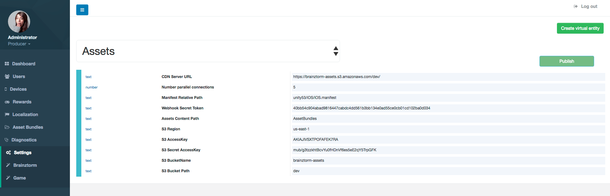
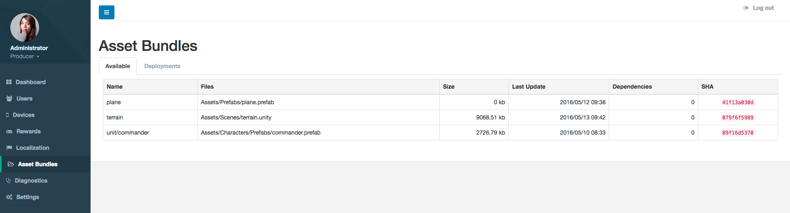
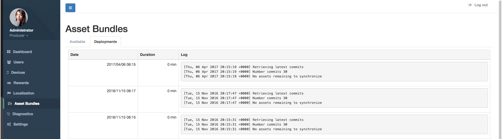

########################
AssetBundles Admin Tools
########################

**********
How to use
**********
First, you need to configure the general parameters for Asset Bundles works, 
like Server URL where the client fetches the Asset Bundles.

When you publish new Asset Bundles, they will be shown in the ``Available`` tap within 
Asset Bundles section.

Each time you publish Asset Bundles, they will be proccesed and deployed to your Server 
bucket. You can look the history in the ``Deployments`` tap within Asset Bundles section.

