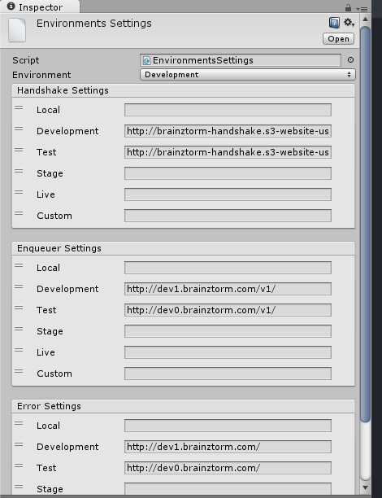

*******************
Communications SDK
*******************

Introduction
===============
*<Insert lovely written introduction here>*

Configuration
=============
To start using the communications component you need to setup a server which will
handle the requests, a server to handle error reports and upload a handshake configuration
file which will allow you to easily configure the servers your players interact with.

Once you got those urls, you need to put them in the *Environment Settings* scriptable
object inside the settings folder as follows:

You can verify everything is working in the *Demo Communications Events* scene, if everything
works perfectly you should see both texts Handshake and Communications turn green.

How to Use
==========
The server exposes delegates which handle specific transaction types, processing
the data sent with the request object and retrieving anything needed for the response.
These delegates are called *listeners*.

To interact with a listener you need to know the type of transaction it handles,
the data that should be sent in the request object, and what to expect in the response.

Making Requests
---------------
Let's suppose we have a Daily Missions component, we give players daily tasks to
fulfill and we reward them with in-game items or currency for the effort. We are going
to review the Claim Rewards transaction, in which the client notifies the backend to
give the rewards once the mission has been completed. To claim a daily mission we need it's
code and an authentication token generated by the backend server previously to avoid hacks.
The request object would look something like this:

.. code-block:: javascript

  {
    "type": "ClaimDailyMission",
    "mission": "WinXPvE",
    "token": "E3C6559FCCC31186247A3D058E2E5E78"
  }

We serialize request objects to fit this json specification, so to make a request you just
need to map the expected *json* structure to a *C#* class.
The *C#* class that maps to our structure would be:

.. code-block:: c#

  public class ParamsForClaimDailyMission: ParamsForTransaction
  {
    public string mission;
    public string token;

    public ParamsForClaimDailyMission(): base("ClaimDailyMission")
    {
    }
  }

We extended a base class called *ParamsForTransaction*, all request classes should
inherit from this class.

Now, in order to send our request to claim the rewards for a daily mission, we create
a request object, set the appropriate parameters and send it through the communications
module facade, which is the interface **ITransactions**:

.. code-block:: c#

  public class DailyMissionClaimer
  {
    [Inject]
    private ITransactions transactions;

    public void ClaimDailyMission(string mission, string token)
    {
      ParamsForClaimDailyMission request = new ParamsForClaimDailyMission();
      request.mission = mission;
      request.token = token;

      transactions.Enqueue(request);
    }
  }

So this is how we send data to the backend server:
1. Define the json structure expected by our backend server.
2. Create a C# class that inherits from ParamsForTransaction and add all parameters
as public attributes.
3. Create a utility class that uses the required parameters to create a request
object and sends it through the **ITransactions** facade.

Enqueue or Send?
----------------
In the last example we used the *enqueue* method so our request would reach the server.
The transactions facade has many overloads for different use cases of the communications component,
but basically it exposes the *enqueue* and *send* methods.

We need a server to handle each request, read databases and perform operations needed by each
listener. Server's performance is a critical issue, the volume of users can grow rapidly,
demanding more server resources to fulfill each player's requests. And since games are
real-time programs that perform complex operations, response time should be kept to a minimum.
Poor server performance can hinder the player's experience and might solely drive them off your game.

In order to make efficient use of server resources, Brainztorm groups *transactions* in a queue and
sends them automatically within a given time interval. All *queued transactions* wait until the
time interval is finished an then a *request* is made to the backend server. However, there might be
some circumstances in which the response to a transaction is needed urgently; these are the scenarios
in which **Send** should be used instead of **Enqueue**, all pending transactions are sent to be processed
inmediately.

Handling Responses
------------------
Our last example sent data to the server, but it didn't expect a response. It's really common
to ask the server for information: from inbox messages to quest log data, or maybe we just need to
know once the transaction has been handled: for example an error report.

The **ITransactions** interface exposes overloads that allows to: only send data,
invoke a callback once the transaction has been handled, and receive an object response.

Sending a transaction and expecting a callback once it's processed would be done
like this:

.. code-block:: c#

  public void SendPingTransaction()
  {
    ParamsForTransaction pingRequest = new ParamsForTransaction("Ping");
    transaction.Enqueue(pingRequest, LogSuccess);
  }

  private void LogSuccess()
  {
    Debug.Log("Ping was handled by server.");
  }

Since the ping transaction doesn't have any parameters, there is no need to create
a class that maps to the request object, we can use the *ParamsForTransaction* class
directly.

In the scenario where we need to get a response from a transaction, we need to create
a *C#* class that matches the *json* specification of response sent by the server. Let's
say we want to retrieve the list of daily missions available to a player. Let's assume
the request doesn't need any parameters, the request and response would be:

.. code-block:: javascript

  //request
  {
    "type": "GetDailyMissions"
  }

  //response
  {
    "type": "GetDailyMissions"
    "data": {
      "expires": 3600, //the time in seconds until the missions expire.
      "missions": [
        {
          "code": "WinXPvE",
          "token": "E3C6559FCCC31186247A3D058E2E5E78",
          "description" "Win 10 PvE matches"
        },
        {
          "code": "WinXArena",
          "token": "DD613FE7AE32487F8C6379F7CA450704",
          "description" "Win 10 Arena matches"
        }
      ]
    }
  }

The response would map to this class structure:

.. code-block:: c#

  [SerializableFromHashtable]
  public class GetDailyMissionsResponse
  {
    public int expires;
    public List<DailyMissionData> missions;
  }

  [SerializableFromHashtable]
  public class DailyMissionData
  {
    public string code;
    public string token;
    public string description;
  }

Note that the response class maps to the *data* object inside the response, whereas the
request classes maps directly to the requests json.

The response given to the callback by the **ITransactions** interface is of type object.
So you can either use our **Serializator** to de-serialize the data or use the **TransactionsHelper**
utility class to do it for you, we recomend the later one:

.. code-block:: c#

  public class DailyMissionsFetcher
  {
    [Inject]
    private ITransactions transactions;

    [Inject]
    private TransactionsHelper helper;

    public void GetDailyMissions(Action<List<DailyMissionData>> onGotMissionsCallback)
    {
      Action<object> deserializingCallback = helper.MakeHashtableDeserializingCallback<GetDailyMissionsResponse>(onGotMissionsCallback);
      ParamsForTransaction request = new ParamsForTransaction("GetDailyMissions");
      transactions.Enqueue(request, deserializingCallback);
    }
  }
