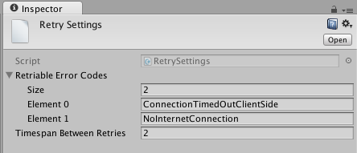
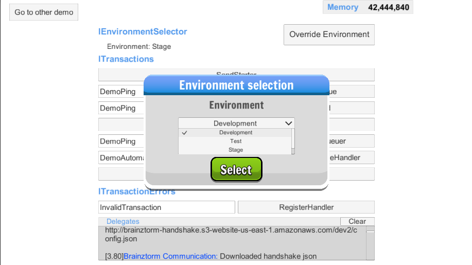

*******************
Communications SDK
*******************

Introduction
===============
*<Insert lovely written introduction here>*

Configuration
=============
To start using the communications component you need to setup a server which will
handle the requests, a server to handle error reports and upload a handshake configuration
file which will allow you to easily configure the servers your players interact with.

Once you got those urls, you need to put them in the *Environment Settings* scriptable
object inside the settings folder as follows:

.. image:: environment-settings.png

You can test different environments and keep the configurations for each one updated.

You can verify everything is working in the *Demo Communications Events* scene, if everything
works perfectly you should see both texts Handshake and Communications turn green.

How to use
==========
The server exposes delegates which handle specific transaction types, processing
the data sent with the request object and retrieving anything needed for the response.
These delegates are called *listeners*.

To interact with a listener you need to know the type of transaction it handles,
the data that should be sent in the request object, and what to expect in the response.

Making Requests
---------------
Let's suppose we have a Daily Missions component, we give players daily tasks to
fulfill and we reward them with in-game items or currency for the effort. We are going
to review the Claim Rewards transaction, in which the client notifies the backend to
give the rewards once the mission has been completed. To claim a daily mission we need it's
code. The request object would look something like this:

.. code-block:: javascript

  {
    "type": "ClaimDailyMission",
    "mission": "WinXPvE",
  }

We serialize request objects to fit this json specification, so to make a request you just
need to map the expected *json* structure to a *C#* class.
The *C#* class that maps to our structure would be:

.. code-block:: c#

  public class ParamsForClaimDailyMission: ParamsForTransaction
  {
    public string mission;

    public ParamsForClaimDailyMission(): base("ClaimDailyMission")
    {
    }
  }

We extended a base class called *ParamsForTransaction*, all request classes should
inherit from this class.

Now, in order to send our request to claim the rewards for a daily mission, we create
a request object, set the appropriate parameters and send it through the communications
module interface, which is the interface **ITransactions**:

.. code-block:: c#

  public class DailyMissionClaimer
  {
    [Inject]
    private ITransactions transactions;

    public void ClaimDailyMission(string mission)
    {
      ParamsForClaimDailyMission request = new ParamsForClaimDailyMission();
      request.mission = mission;

      transactions.Enqueue(request);
    }
  }

So this is how we send data to the backend server:

1. Define the json structure expected by our backend server.
2. Create a C# class that inherits from ParamsForTransaction and add all parameters
as public attributes.
3. Create a utility class that uses the required parameters to create a request
object and sends it through the **ITransactions** interface.

Handling Responses
------------------
Our last example sent data to the server, but it didn't expect a response. It's really common
to ask the server for information: from inbox messages to quest log data, or maybe we just need to
know once the transaction has been handled: for example an error report.

The **ITransactions** interface exposes overloads that allows to: only send data,
invoke a callback once the transaction has been handled, and receive an object response.

Sending a transaction and expecting a callback once it's processed would be done
like this:

.. code-block:: c#

  public void SendPingTransaction()
  {
    ParamsForTransaction pingRequest = new ParamsForTransaction("Ping");
    transaction.Enqueue(pingRequest, LogSuccess);
  }

  private void LogSuccess()
  {
    Debug.Log("Ping was handled by server.");
  }

Since the ping transaction doesn't have any parameters, there is no need to create
a class that maps to the request object, we can use the *ParamsForTransaction* class
directly.

In the scenario where we need to get a response from a transaction, we need to create
a *C#* class that matches the *json* specification of response sent by the server. Let's
say we want to retrieve the list of daily missions available to a player. Let's assume
the request doesn't need any parameters, the request and response would be:

.. code-block:: javascript

  //request
  {
    "type": "GetDailyMissions"
  }

  //response
  {
    "type": "GetDailyMissions"
    "data": { //custom data
      "expires": 3600, //the time in seconds until the missions expire.
      "missions": [
        {
          "code": "WinXPvE",
          "description" "Win 10 PvE matches"
        },
        {
          "code": "WinXArena",
          "description" "Win 10 Arena matches"
        }
      ]
    }
  }

The response would map to this class structure:

.. code-block:: c#

  [SerializableFromHashtable]
  public class GetDailyMissionsResponse
  {
    public int expires;
    public List<DailyMissionData> missions;
  }

  [SerializableFromHashtable]
  public class DailyMissionData
  {
    public string code;
    public string description;
  }

Note that the response class maps to the *data* object inside the response, whereas the
request classes maps directly to the requests json.

The response given to the callback by the **ITransactions** interface is of type object.
So you can either use our **Serializator** to de-serialize the data or use the **TransactionsHelper**
utility class to do it for you, we recomend the later one:

.. code-block:: c#

  public class DailyMissionsFetcher
  {
    [Inject]
    private ITransactions transactions;

    [Inject]
    private TransactionsHelper helper;

    public void GetDailyMissions(Action<List<DailyMissionData>> onGotMissionsCallback)
    {
      Action<object> deserializingCallback = helper.MakeHashtableDeserializingCallback<GetDailyMissionsResponse>(onGotMissionsCallback);
      ParamsForTransaction request = new ParamsForTransaction("GetDailyMissions");
      transactions.Enqueue(request, deserializingCallback);
    }
  }

Receiving data from the backend is similar to sending it, this covers most of the scenarios
which you will need to handle with the communications component.

Transactions queue
------------------
In the last example we used the *Enqueue* method so our request would reach the server.
The transactions interface has many overloads for different use cases of the communications component,
but basically it exposes the *Enqueue* and *Send* methods.

We need a server to handle requests, read databases and perform operations needed by each
listener. Server's performance is a critical issue, the volume of users can grow rapidly,
demanding more server resources to fulfill each player's requests. And since games are
real-time programs that perform complex operations, response time should be kept to a minimum.
Poor server performance can hinder the player's experience and might solely drive them off your game.

In order to make efficient use of server resources, Brainztorm groups *transactions* in a queue and
sends them automatically within a given time interval. All *queued transactions* wait until the
time interval is finished an then a *request* is made to the backend server. However, there might be
some circumstances in which the response to a transaction is needed urgently; these are the scenarios
in which **Send** should be used instead of **Enqueue**, all pending transactions are sent to be processed
inmediately. A common transaction request would look like this:

.. code-block:: javascript

  {
    "UUID": "4A268025-74C2-5E81-ADC0-150071D4E306",
    "start": false,
    "transactions": [{
        "pos": 0,
        "data": {
            "type": "DemoPing"
        },
        "elapsedTime": 0
    }, {
        "pos": 1,
        "data": {
            "frames": 376,
            "time": 7,
            "type": "SendQuality",
            "scene": "Demo Communication",
            "criticals": 3,
            "resolution": 1,
            "qualityLevel": 4
        },
        "elapsedTime": 0
    }]
  }

Each transaction has 2 additional parameters

pos
  The order in which the transactions were enqueued and will be handled.

elapsedTime
  The time they waited in the queue before it was sent.

And the response for this request would be this one:

.. code-block:: javascript

  {
    "code": "NoError",
    "data": [{
        "type": "DemoAutomaticResponse",
        "pos": -1,
        "data": {
            "time": 1461797482
        }
    }, {
        "type": "DemoPing",
        "pos": 0,
        "data": []
    }, {
        "type": "SendQuality",
        "pos": 1,
        "data": []
    }]
  }

A response object for each enqueued transaction and a *code* field, if this field
is set to *NoError*, states that the server processed the request successfully.

Automatic transactions
----------------------
In the previous response you might have noticed that there's an additional object
which doesn't correspond to any requested transaction.

.. code-block:: javascript

  {
      "type": "DemoAutomaticResponse",
      "pos": -1,
      "data": {
          "time": 1461797482
      }
  }

Automatic transactions provide a way in which the server can notify the client
in an event driven manner. For example the user could have reached the required
level to unlock an special dungeon, or a world boss event is happening, etc.

To subscribe a handler for an automatic transactions, you need to use the method
*RegisterAutomaticResponseHandler*:

.. code-block:: c#

  public class RegisterAutomaticResponseHandler
  {
    [Inject]
    private ITransactions transactions;

    [PostInject]
    private void RegisterHandler()
    {
      transactions.RegisterAutomaticResponseHandler("DemoAutomaticResponse", HandleResponse);
    }

    private void HandleResponse(object response)
    {
      Debug.Log("Automatic response handled: " + BrainztormJSON.JsonEncode(response));
    }
  }

Recurring enqueuer
------------------
In case you need to send an specific transaction with each requests, you need to
implement a recurring enqueuer. This enqueuer will enqueue your transaction automatically
right before the request is sent. For example, we might want to keep track of game's fps.

.. code-block:: javascript

  {
    "frames": 376,
    "type": "TrackFPS",
    "scene": "Demo Communication"
  }

You need to implement the **IRecurringEnqueuer** interface and register your implementation
to the **ITransactions** interface, the *GetParameters* method will be called with each
request.

.. code-block:: c#

  public class ParamsForTrackFPS: ParamsForTransaction
  {
    public int fps;
    public string scene;

    public ParamsForTrackFPS(): base("TrackFPS")
    {
    }
  }

  public class FPSTracker: IRecurringEnqueuer, IInitializable, ITickable
  {
    [Inject]
    private ITransactions transactions;

    private int frames;
    private float time;

    public void Initialize()
    {
      transactions.RegisterRecurringEnqueuer(this);
    }

    public void Tick()
    {
      frames++;
      time += Time.deltaTime;
    }

    public ParamsForTransaction CreateParams()
    {
      ParamsForTrackFPS parameters = new ParamsForTrackFPS();
      parameters.fps = frames / time;
      parameters.scene = SceneManager.GetActiveScene().name;

      Reset();
      return parameters;
    }

    private void Reset()
    {
      time = 0;
      frames = 0;
    }
  }

If you want to skip the transaction for some reason, returning *null* will skip
the recurring enqueuer once.

Session
=======
Before transactions start being handled, the client needs to stablish a session
with the server which will handle it's requests. This process happens in 2 stages,
the *handshake* and the *session start*.

Handshake
---------
Games that rely on a backend server can be complex to update and mantain. There can
be a lot of reasons in which you would need to change the server that clients use
urgently, maybe a new update or a faulty server.

The handshake stage fetches information about the servers which it should deal with,
configuring this urls before doing anything else. The handshake configuration is
fetched from a *json* file stored in the url configured in the *Environment Settings*
scriptable object. It looks like this:

.. code-block:: javascript

  {
    "android": {
        "isUnderMaintenance": false,
        "minVersion": "0.1.1",
        "maxVersion": "0.1.3",
        "appUrl": "market://details?id=com.example.android",
        "rateUrl": "market://details?id=com.example.android",
        "transactionServer": "http://dev1.brainztorm.com/v1/",
        "errorServer": "",
        "maxVersionServer": "http://dev2.brainztorm.com/v1/",
        "maxVersionErrorServer": "http://dev2.brainztorm.com/v1/"
    },
    "ios": {
        "isUnderMaintenance": false,
        "minVersion": "0.1.1",
        "maxVersion": "0.1.3",
        "appUrl": "https://itunes.apple.com/us/app/apple-store/id375380948?mt=8",
        "rateUrl": "https://itunes.apple.com/us/app/apple-store/id375380948?mt=8",
        "transactionServer": "http://dev0.brainztorm.com/v1/",
        "errorServer": "",
        "maxVersionServer": "http://dev1.brainztorm.com/v1/",
        "maxVersionErrorServer": "http://dev1.brainztorm.com/v1/"
    },
    "editor": {
        "isUnderMaintenance": false,
        "minVersion": "0.1.1",
        "maxVersion": "0.1.3",
        "appUrl": "http://unity.com",
        "rateUrl": "http://unity.com",
        "transactionServer": "",
        "errorServer": "",
        "maxVersionServer": "http://dev2.brainztorm.com/v1/",
        "maxVersionErrorServer": "http://dev2.brainztorm.com/v1/"
    }
  }

As you can see, there is an independent configuration object per platform each setting
changes the way the client behaves:

transactionServer
  Url of the server which will handle the transactions sent by the client. If it's
  left empty the one configured in the *environment settings* will be used.

errorServer
  Url of the server which will handle error reports sent by the client. If it's
  left empty the one configured in the *environment settings* will be used.

isUnderMaintenance
  Blocks all incoming connections if set to true and a popup
  is displayed to players.

minVersion
  Oldest required version to play the game, if the current version is older than
  the required one, player will be redirected to the *appUrl* to update the application.

maxVersion
  Highest version supported by the server, usually it's useful when you are testing an
  update and want to test with your staging servers. If the current version is higher,
  the client uses the *maxVersionServer* and *maxVersionErrorServer*.

appUrl
  Url of the appstore to update the client.

rateUrl
  Url to rate the application.

Once this file is downloaded and the configuration applyed, the client continues
to the next stage.

Session start
-------------
A session needs to be started with the transactions server which was determined
during the *handshake* stage. This is done with a special transaction called the
*starter*, this transaction contains device-specific data such as the unique identifier
that let's brainztorm know how to fetch user related data.

.. code-block:: javascript

  {
    "data":{
      "type":"TransactionStarter",
      "build":"0.1.3",
      "deviceData":{
        "UUID":"4A268025-74C2-5E81-ADC0-150071D4E306", //Unique device identifier
        "hardware":{
          "graphicsDeviceName":"Emulated GPU running OpenGL ES 2.0",
          "memorySize":8192,
          "resolution":{
            "width":1920,
            "height":1080
          },
          "graphicsMemorySize":1024
        },
        "osVersion":"Mac OS X 10.11.4",
        "deviceModel":"iMac11,2",
        "platform":"Editor"
      },
      "timezone":"-5:00",
      "networkIdData":[
        {
          "type":"GameCenter",
          "networkId":"1000",
          "nickname":"Lerpz"
        }
      ],
      "locale":"EN"
    }
  }

This transaction is sent in the first request, alongside with any other initialization
related transaction.

Events
------
If you want to enqueue your own initialization transactions or do something once the
session has been started and brainztorm was initialized, you need to subscribe to the
events provided in the **ICommunicationEvents** interface.

.. code-block:: c#

  using UnityEngine;
  using System.Collections;
  using Zenject;
  using Brainztorm.Communication;

  public class CommunicationEventsLogger : MonoBehaviour {
    [Inject]
    private ICommunicationEvents events;

    [PostInject]
    private void SubscribeToEvents()
    {
      events.OnHandshakeFinished += LogHandshakeEvent;
      events.OnStarterFinished += LogStarterEvent;
    }

    private void LogHandshakeEvent()
    {
      Debug.Log("Handshake finished");
      //Enqueue your initializationtransactions here.
    }

    private void LogStarterEvent()
    {
      Debug.Log("Starter finished");
      //Safely use all brainztorm features.
    }
  }

Handling errors
===============
If an error is detected by the backend, the status in the response will be different
to *NoError*, brainztorm handles all internal errors by default. But since you can
extend brainztorm you can send custom error codes and information for your client
to be handled. This behaviour is achieved by using the **ITransactionErrors** interface.

This interface is where to configure custom errror handlers, which should implement
the interface **IErrorHandler**.

.. code-block:: c#

  public class DummyErrorHandler : IErrorHandler, IInitializable
  {
    [Inject]
    private ITransactionErrors transactionErrors;

    public void Initialize()
    {
      transactionErrors.RegisterHandler("DummyError", this);
    }

    public void OnFailed(IErrorData error)
    {
      Debug.LogWarning("A DummyError ocurred during a transaction.");
    }
  }

If no error handler can be resolved for the error code, a default handler will
be triggered, by default this handler shows a popup indicating a problem ocurred.
The default handler can be set as follows:

.. code-block:: c#

  public class MyDefaultHandler: IInitializable, IErrorHandler
  {
      [Inject]
      private ITransactionErrors transactionErrors;

      public void Initialize()
      {
        transactionErrors.SetDefaultHandler(this);
      }

      public void OnFailed(IErrorData error)
      {
        Debug.LogWarning("Non-handled error ocurred during transaction");
      }
  }

However, sometimes you want transactions to be retried instead of triggering the
error handling behaviour. By default brainztorm retries connection related issues
a given ammount of times, if you want to add other errors to be retried you can do
so in the *Retry Settings* scriptable object, as well as configuring the timespan
between retries.

And if you want to perform more complex operations while determining if a retry can be done
you need to implement the interface **ICanRetryErrorCodeHandler**. For example, this is
how we handle WwwErrors by default; we check if it contains an HTTP status code and
handle it appropriately.

.. code-block:: c#

  public class CanRetryWWWErrorCodeHandler : ICanRetryErrorCodeHandler, IInitializable
  {
    [Inject]
  	private ICustomRetryTransactionsHandler customHandlers;

  	public void Initialize()
  	{
  		customHandlers.SetCustomRetryHandler("WwwError", this);
  	}

    public bool CanRetry(IErrorData error, bool hasRetriableQueue)
    {
      int statusCode;
      bool hasStatusCode = TryGetStatusCode(error, out statusCode);
      return !hasStatusCode || statusCode >= 500;
    }

    private bool TryGetStatusCode(IErrorData error, out int statusCode)
    {
      statusCode = 0;
      if (!error.CustomAttributes.ContainsKey("status"))
        return false;
      else
      {
        statusCode = (int)error.CustomAttributes["status"];
        return true;
      }
    }
  }

Others
======

Transactions reset
------------------
If for some reason, you need to stop all transaction processing, you need to call
the **ITransactions** interface *Reset*.

.. code-block:: c#

  public class TransactionStopper: MonoBehaviour
  {
    [Inject]
    private ITransactions transactions;

    private void Update()
    {
      if(Input.GetKeyDown(KeyCode.Space))
      {
        //Stop all transactions
        transactions.Reset();
      }
    }
  }

Environment override
--------------------
You might need to change environment from a build in order to test against different
servers. To do so you can just put an *OverrideEnvironmentButton* prefab in any scene;
pressing this button will show a popup displaying all properly configured environments.
After an option is selected, the environment will be changed and the game will be restarted.

