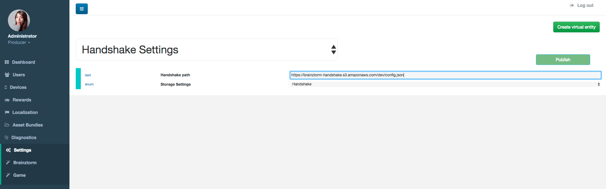
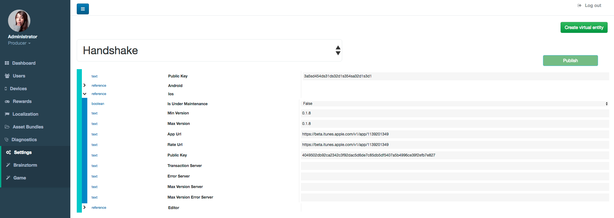

#####################
Server Communications
#####################

Provides a communication layer that isolates data transfer between client and server, validating format, 
field types and enforcing a required data structure in the request and response. It also reads each one of 
the transactions and trigger events in a generic way so custom listeners can be attached to perform game specific actions.

************
Transactions
************
All the actions performed in the client are enqueued and send periodically in batch to the server, 
after processing and performing all the necessary logic provided by the listeners, 
the server returns to the client the result of each one of them.

*********
Listeners
*********
The communications engine is based on an events manager which provides us a decoupled publish and subscribe (Pub/Sub) 
architecture. After receiving a transaction from the client, the TransactionExecutor will fire an event to the 
responsible component, then the execute method will be called in each of listeners that are attached to this component. 
A TransactionResponse object is expected as the return of each one of them. The listeners have to extend the 
TransactionListener class and are attached to the events manager based on the type name automatically by Brainztorm.

**********
Validators
**********
If the execution environment is not production, input and output data is validated in every transaction. 
The validation is performed using a JSON Schema. All listeners should specify a validator class in an 
annotation @Validation (class=<validator class>) at the class level. That validator class should implement 
the TransactionValidator interface, which defines methods getInputSchema for validating input values and 
getOutputSchema for validating output values, they expect as return an array with the expected JSON schema fields, 
their types and whether they are required among other possibilities.

The following is an example of a listener alongside its validators:

.. code-block:: php

  <?php
  
  namespace MyGame\Listeners;
  
  use Brainztorm\Transactions\TransactionListener;
  use Brainztorm\Transactions\TransactionValidator;
  
  /**
   * StorePlayerStatusListener
   *
   * Allows to update a player status
   *
   * @Validation(class=this)
   */
  class StorePlayerStatusListener extends TransactionListener implements TransactionValidator
  {
     /**
      * Returns a JSON-schema structure to validate the input of this transaction
      */
     public function getInputSchema()
     {
         return [
             'type' => 'object',
             "properties" => [
                 "playerId"    => ["type" => "string"],
                 "progress"  => ["type" => "integer"]                
             ],
             "required" => ["player", "progress"]
         ];
     }
     
     /**
      * Returns a JSON-schema structure to validate the output of this transaction
      */
     public function getOutputSchema()
     {
         return [];
     }
     
     /**
      * Listener implementation
      *     
      */
     public function execute($event, $executor, $data)
     {
         // ...
     }
  }

******************
Handshake Settings
******************
Games that rely on a backend server can be complex to update and mantain. There can
be a lot of reasons in which you would need to change the server that clients use
urgently, maybe a new update or a faulty server.

The handshake configuration is fetched from a JSON file, you have to specify the URL where to 
download this file. To do this, go to theAdmin Tools *Settings - Brainztorm* section and select 
*Handshake Settings* from the main dropdown and enter the URL as shown in the following image. 

In this image you can see an URL from an Amazon S3 service where the config.json file is hosted.

Handshake file contents could be configured also in Admin Tools through *Settings - Brainztorm*, 
and selecting *Handshake* in the main dropdown settings as shown in the image below. 
Notice the different platforms you can set in order to customize the behaviors.

The *Public Key* property refers to the token for accessing to Amazon S3 service (in this example).