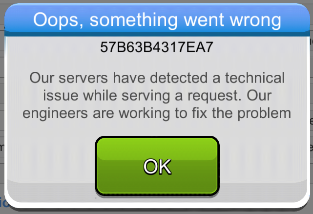
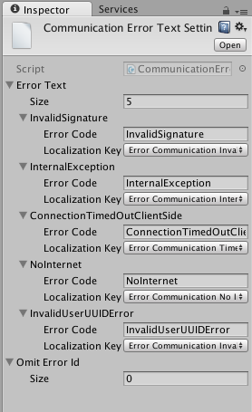

Client Error Reporting
======================

Introduction
------------
Brainztorm's error reporting component helps you detect and debug bugs, errors, and crashes in your game through different
development steps. Providing a unified place to track errors and a friendly way to interact with the user when these occur.

<error intro>

How to use
----------
The error reporting component is one of brainztorm core components, which means it will be always enabled. It will create reports automatically for: application crashes (iOS only), server errors and detected brainztorm sdk malfunction. 

.. image:: images/errors.png

There's 2 kinds of errors: server-side errors and client-errors, both of them are handled similarly. When brainztorm detects a client-side error, a popup with related info is created; this popup includes a unique error id that customers can use to contact support and inform them of the situation.

For example, if the player was buying a product from the store and an internal server error happens, transaction data could have not been handled appropriately by the server, leading to missing currency or services. With the corresponding error id, support can verify, reproduce and identify what caused the error.

Server error handlers
^^^^^^^^^^^^^^^^^^^^^
Whenever an error is detected in the server, a report will be created in the error server and the registered error handler will be invoked. To register error handlers for a given error, you need to create an implementation of the *IErrorHandler* interface. This should be registered to *ITransactionErrors* in order to be triggered.

.. code-block:: c#

  public class MyErrorHandler: IErrorHandler, IInitializable
  {
    [Inject]
    private ITransactionErrors transactionErrors;
  
    public void Initialize ()
    {
      transactionErrors.Add("my-error-type", this);
    }
    
    public void OnFailed(IErrorData error)
    {
      //DO SOMETHING
    }
  }

There's a default error handler, which uses the same error popup and restarts the game when the player dismisses it. To change what is shown to the player in this popup, you can change the *Communication Error Text Settings* either through the configuration view or the settings asset directly.

Your error handlers can use the error popup as well, through the *IGenericTransactionErrorPopupMaker* interface you create a popup which will invoke an action you define when dismissed.

.. code-block:: c#

  public class MyPopupErrorHandler: IErrorHandler, IInitializable
  {
    [Inject]
    private ITransactionErrors transactionErrors;
    
    [Inject]
    private IGenericTransactionErrorPopupMaker popupMaker;
  
    public void Initialize ()
    {
      transactionErrors.Add("my-error-type", this);
    }
    
    public void OnFailed(IErrorData error)
    {
      popupMaker.Show (error, OnDismissed);
    }
    
    private void OnDismissed()
    {
      //DO SOMETHING
    }
  }

How it works
------------
Error reports are generated for server errors, client errors and crashes. These error reports contain the following information:

- *Id* (string): The unique error id.
- *ErrorType* (string): The error type, e.g. InvalidUserId.
- *Content* (string): A stacktrace, request or detailed info with detailed information of how the error report was created.
- *Time* (int): A UNIX timestamp of the time the error happened.
- *Build* (string): The build version that has the reported problem.
- *Hash* (string): A hash of the content, used to avoid the same error triggering a report often.

Server errors
^^^^^^^^^^^^^
Server-side errors are sent by the server to the client as the response of the transaction which caused it, then these are sent to the error server together. These error response includes the following information:

- *Error Id* (string): A unique error identifier.
- *Error Code* (string): The error type or categorization.
- *Message* (string): A message sent by server describing what happened.
- *Custom Attributes* (hashtable): Any custom attributes sent by the server when the error was detected as a key-value dictionary, these come handy for custom error handlers.

The client then submits an error report with both the error data an a JSON string of the request which caused, allowing backend developers to reproduce the scenario easily through HTTP tools.

Client errors
^^^^^^^^^^^^^
Brainztorm detects errors under different circumstances: may a purchased product miss the receipt validation, a missing key on the localization dictionary, etc. For these situations an error report is submitted to the error server with information regarding the error. These are available only for Brainztorm components.

Crashes
^^^^^^^
Brainztorm uses the CrashReport_ API, which is currently available only for ios. These are sent on start and a popup notifying you about it will be displayed. The content has a detailed stack trace that the server symbolizes in order to make it easier to debug.

.. _CrashReport: https://docs.unity3d.com/ScriptReference/CrashReport.html
