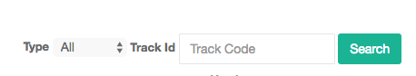
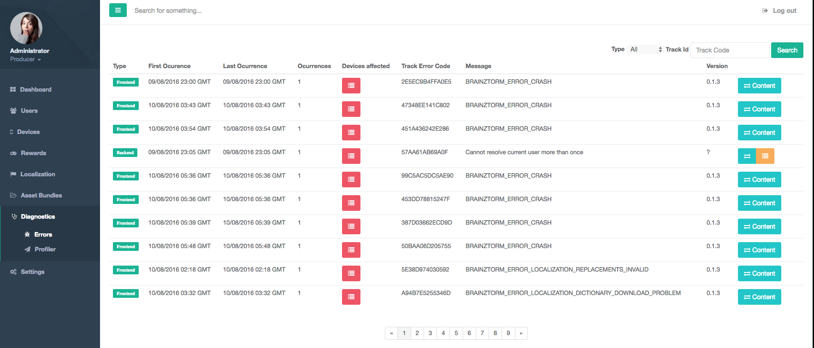

Show errors in Admin Tools
==========================
Unde the *Diagnostics > Errors* option, you can see all error reports made by the client, ordered from lastest insidence to the oldest. These error reports include server failures, brainztorm sdks detected errors and crashes.

At the right top of the screen, you can find filters to group by type of errors or show a specific error by its unique id.

In the list of errors you can see the following properties:

- **Type**: Shows the type of error that has been sent: Frontend (Client) or Backend (Server).
- **First ocurrence**: Shows the date of first ocurrence of this error.
- **Last ocurrence**: Shows the date of last ocurrence of this error.
- **Ocurrence**: Shows the number of ocurrences of this error.
- **Devices afected**: Shows a list of devices that have reported this error.
- **Track error code**: Shows the code of this error.
- **Message**: Shows a short message or description of this error.
- **Version**: Shows the Brainztorm version that have been used to report this error.
- **Content**: Button to display the content of message reported by the client side.
- **Backtrace**: Button that only appears when the error is of type "Backend" to show the backtrace of the error.
