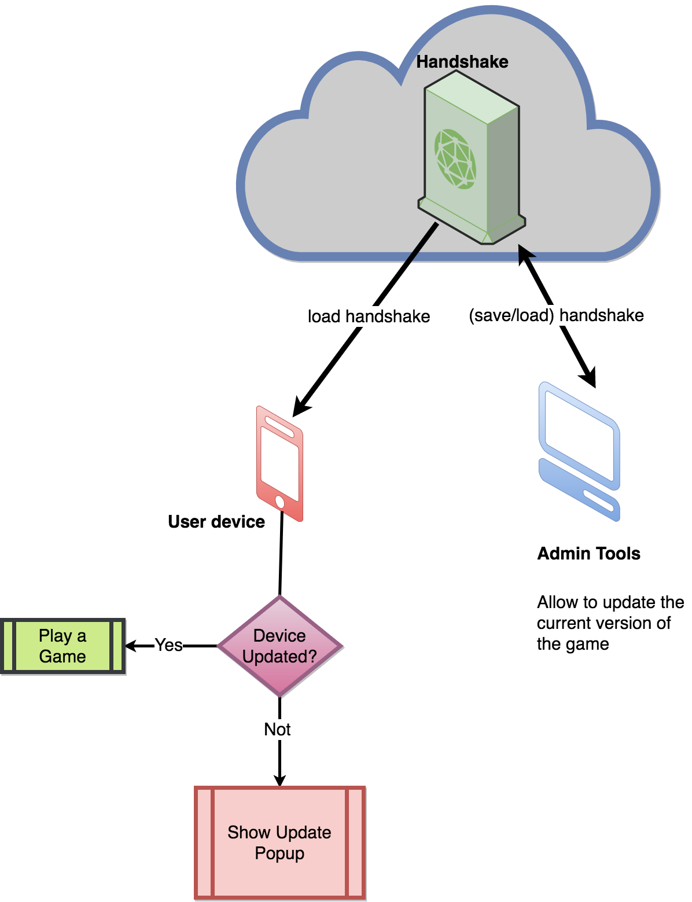
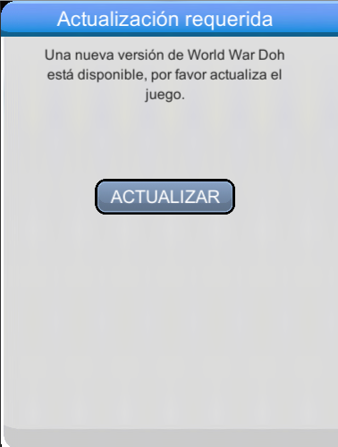

######################
Force Update Unity SDK
######################

It's a core module so it doesn't need to be activated, its functionality is provided by default. 

The device validate the current version installed in the device and show the update popup if the version is deprecated. 
If the game is deprecated the device can't play the game and force to update the game with a update button.

Look the image below:

