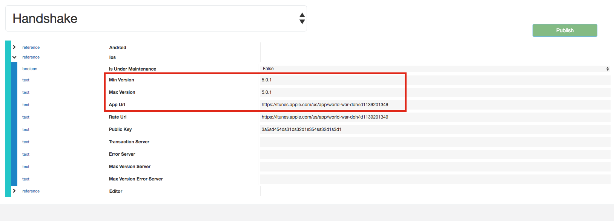

######################
Force Update Settings
######################

Admin tools allow to update the handshake in the option "Settings > Brainztorm". The handshake controll the current version and app link of the game. 

When we update the fields "minimum version" and "maximum version" force the game to update and redirectioning to link setted in handshake with the field name "app url". 

Look the image below:

