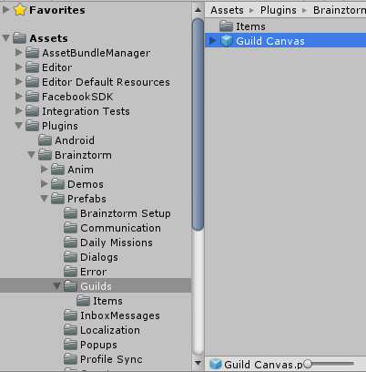
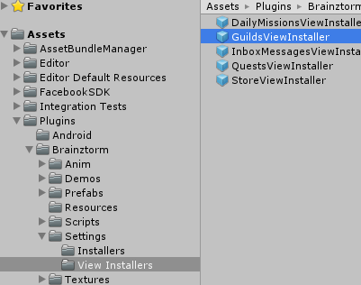
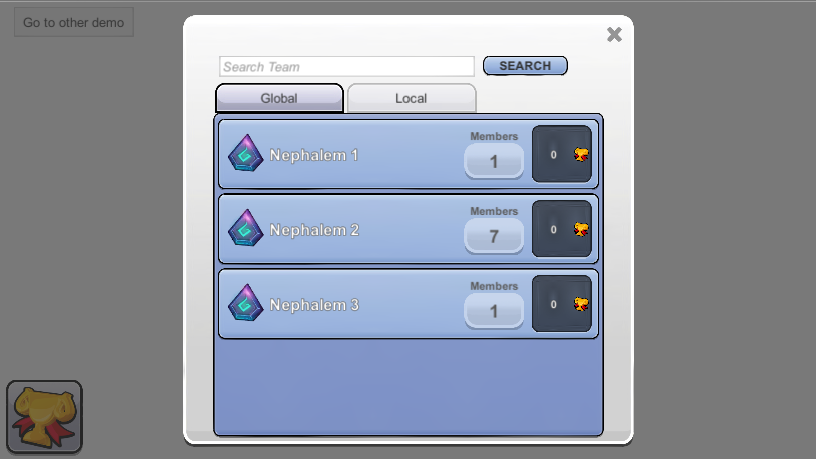

###############
Guilds Unity SDK
###############

`Documentacion del API`_

**********
Como Usar
**********
Para utilizar este módulo, lo primero que debes hacer es activarlo
en el menu del editor `Brainztorm > Settings`_.

.. note::

    Para probar una correcta integracion del proceso, es necesario activar
    el sistema de logs para este modulo, esto puede hacerse entrando al menu
    en el editor `Brainztorm > Settings > Logging > Guilds`_.

El modulo de Clanes tiene los siguientes componentes:

Uso de las funciones del Componente
===============

Funciones:

- :code:`Guilds.Open()`:
  Metodo que abre la vista del modulo si tiene una configurada.

- :code:'Guilds.Close()':
  Metodo que cierra la vista del modulo si tiene una configurada.

- :code:'Guilds.GetUserGuild()':
  Metodo que llama la transaccion para traer el clan al que pertenece el presente usuario.
  la respuesta llega a traves del evento 'Guilds.OnGotUserGuildInfo<GuildDataWrapper>';
  Si el usuario no está unido a un clan, retornará un valor nulo, si el usuario está unido a un clan, traera la siguiente estructura
  serializada dentro del objeto 'GuildDataWrapper', ejemplo:

  .. code-block:: javascript

      {
          "type": "GetUserGuild",
          "pos": 3,
          "data": {
              "id": {
                  "$id": "586d6e40d55db80e8d685a34"
              },
              "name": "Nephalem 3",
              "icon": "",
              "score": 0
          }
      }

- :code:'Guilds.JoinOrLeaveGuild(string guildId, bool isUserGuild)':
  Método para unirse o dejar un clan. El parametro 'guildId' es el identificador del clan al que me quiero unir/dejar,
  'isUserGuild' es un booleano que consulta si este clan es al que el usuario pertenece, si es asi, lo que hara será dejarlo
  de lo contrario se unira a este clan si es aceptado.

- :code:'Guilds.SearchGuildByNameOrCode(string search)':
  Metodo para buscar una lista de clanes. El parametro 'search' es el nombre o codigo del clan o clanes que estoy buscando,
  la respuesta de este metodo vendra a traves del evento 'Guilds.OnGuildsObtained<GuildData>'; y traerá una lista de los clanes
  que contengan en su nombre o codigo el texto del parametro 'search'. La transaccion traera la siguiente estructura encapsulada en
  una lista de objetos 'GuildData', ejemplo:

  .. code-block:: javascript

      {
      "code": "NoError",
      "data": [{
          "type": "GetGuilds",
          "pos": 0,
          "data": [{
              "id": {
                  "$id": "586d6d99d55db809581f18e2"
              },
              "icon": "",
              "name": "Nephalem 1",
              "score": 0,
              "members": 1,
              "limitMembers": null
          }, {
              "id": {
                  "$id": "586d6da0d55db80e8d685a02"
              },
              "icon": "",
              "name": "Nephalem 2",
              "score": 0,
              "members": 7,
              "limitMembers": null
          }, {
              "id": {
                  "$id": "586d6e40d55db80e8d685a34"
              },
              "icon": "",
              "name": "Nephalem 3",
              "score": 0,
              "members": 1,
              "limitMembers": null
          }]
      }]
    }

- :code:'Guilds.GetGuildsLisyByCatrgory(GuildSearchCollection type)':
  Este metodo tiene la misma funcion que el metodo 'Guilds.SearchGuildByNameOrCode(string search)', su respuesta tambien
  llega a traves de el mismo evento; su diferencia es el parametro 'type', que es un enumerador que contiene las opciones
  de categoria que el usuario puede buscar, en este caso son:

  'GuildSearchCollection.Local': Para traer la lista de clanes del pais del usuario.
  'GuildSearchCollection.Global': Para traer la lista de clanes de todo el mundo.

- :code:'Guilds.GetGuildInfo(string guildId)':
  Método utilizado para traer la informacion de un clan en especifico. El parametro 'guildId' es el identificador del clan
  del cual quiero obtener su informacion. La respuesta de la transaccion viene a traves del evento
  'Guilds.OnGotGuildInfo<GuildData>', que trae la siguiente estructura serializada dentro del objeto 'GuildData', ejemplo:

  .. code-block:: javascript

      {
        "code": "NoError",
        "data": [{
            "type": "GetGuild",
            "pos": 0,
            "data": {
                "name": "Nephalem 3",
                "code": "degduy8dl",
                "description": "aaa",
                "terms": "",
                "type": 0,
                "scoreRequirement": 0,
                "score": 0,
                "country": "CO",
                "icon": "",
                "creationDate": 1483566656,
                "numberMembers": 13,
                "id": {
                    "$id": "586d6e40d55db80e8d685a34"
                },
                "members": [{
                    "range": 0,
                    "userId": {
                        "$id": "579ad9f8189fe3557d185a32"
                    },
                    "score": 0,
                    "type": 3,
                    "userName": "twistedxtra"
                }],
                "limitMembers": null
            }
        }]
    }

Eventos:

- :code:'Action<ReadOnlyCollection<GuildData>> OnGuildsObtained':
  Este evento se dispara cuando una lista de clanes llega desde el backend, es el que trae el resultado de los metodos
  'GetGuildsLisyByCatrgory' y 'SearchGuildByNameOrCode'.

- :code:'Action<GuildInfo> OnGotGuildInfo':
  Este evento se dispara cuando la informacion completa de un clan llega desde el backend, es el que trae el resultado
  del metodo 'GetGuildInfo'.

- :code:'Action<string, bool> OnJoinedToGuild':
  Este evento se ejecuta cuando el usuario consultó a un clan si podia unirse o dejarlo usando el metodo 'JoinOrLeaveGuild',
  Este se dispara cuando no era el clan del usuario y trae dos parametros, uno es el id del guild al cual trate de unirme,
  y otro es un bool que indica si fui aceptado o no en este clan.

- :code:'Action OnLeavedGuild':
  Este evento se ejecuta cuando el usuario consultó a un clan si podia unirse o dejarlo usando el metodo 'JoinOrLeaveGuild',
  este se dispara cuando el clan consultado era el del usuario, y pude dejarlo exitosamente.

- :code:'Action<GuildDataWrapper> OnGotUserGuildInfo':
  Este evento se ejecuta cuando el backend trata de traer la informacion del clan al que pertenece el presente usuario.
  Si el usuario pertenece a un clan, traera la informacion de este clan en un objeto 'GuildDataWrapper', sin embargo si el
  usuario no pertenece a ningun clan, el objeto 'GuildDataWrapper' tendrá un valor nulo.

Uso de la vista del Componente
===============

Un componente muy importante que tambien vale la pena resaltar en este modulo es el de la vista, ya que al
igual que otros modulos como el de Mensajes o la Tienda, el SDK ofrece al usuario una vista prefabricada que utiliza
todas las funciones disponibles en el módulo e integra su completa funcionalidad, el usuario puede utilizar nuestro
componente de vista y colocarle el skin que desee, o puede crear su propio componente de vista y scripts controladores
para tener un uso del modulo mas a su gusto, simplemente utilizando las funciones publicas a las que el usuario tiene acceso.

X.1. Para acceder a la vista del modulo se debe entrar a la carpeta del proyecto 'Assets > Plugins > Brainztorm > Guilds',
en esta carpeta se encuentra el Guild Canvas.prefab que el usuario puede arrastrar a la escena:

Este prefab es un canvas que contiene en su interior dos objetos mas, uno es el botón para abrir la vista, y otro
es el componente de la vista que muestra los datos de los guilds, todos estos objetos pueden ser personalizados
a gusto del usuario si este lo desea.

1. Lo segundo que debe existir en la escena para poder utilizar la vista del modulo, es el instalador de la vista,
el cual tambien es un prefab que se debe arrastrar a la escena; este se puede encontrar en la ubicacion
'Assets > Plugins > Brainztorm > Settings > View Installers'

2. Teniendo ambos prefabs en la escena, lo siguiente es arrastrar la referencia del script 'GuildsView.cs' que contiene
el objeto 'Guilds' dentro del 'Guilds Canvas.prefab', hacia el instalador de la vista, en el campo 'Guilds View'.

.. image:: images/Guilds_View_Object_Reference_Path.png

Si el usuario ha seguido correctamente estos pasos, al momento de reproducir la escena y presionar el botón para abrir la
ventana, verá lo siguiente:

.. note::
    Para apreciar mejor la funcionalidad de la vista de Guilds, es recomendado ver el video
    adjunto en la documentación.
