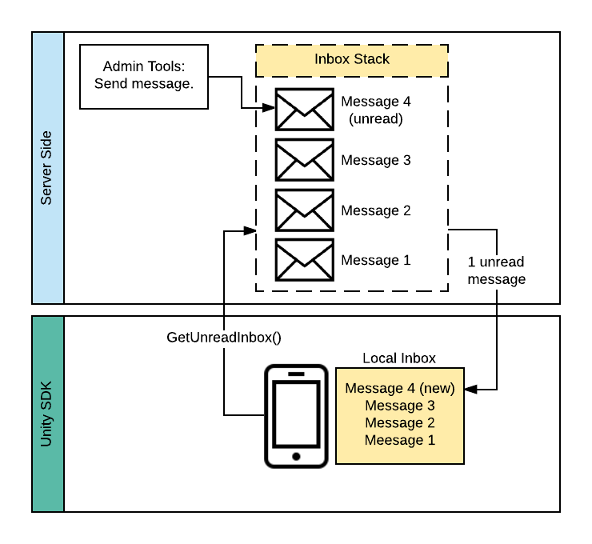

##############
Inbox Messages
##############

************
Introduction
************
Inbox module is the way for sending notifications and rewards from backend 
to the game, either, using Admin Tools or by programming routines in server side. 
In client side, when Brainztorm SDK is initialized, it requests unread messages 
to the server, as shown in the following diagram:

*******
Content
*******
.. toctree::
    :maxdepth: 3

    client.rst
    server.rst
