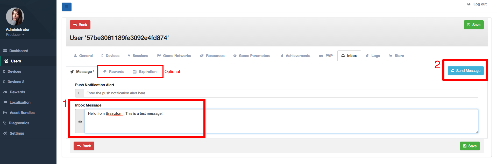
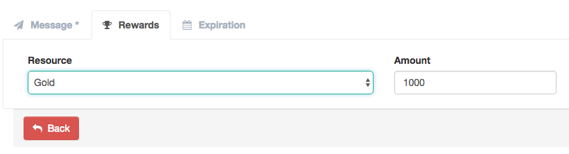
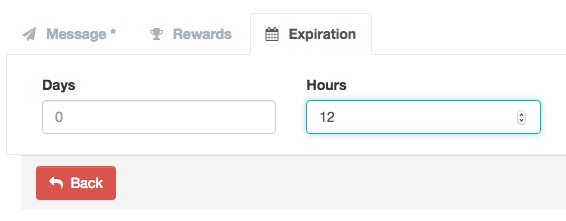

#################
Inbox Admin Tools
#################

You cand send messages and rewards to your users through Admin Tools. 
For doing that, go to Users section, select the destination user 
and go to the Inbox tap, there you find a field for enter the message, and 
optionally, especify a reward type, amount and expiration time for claim this 
resource.

The following image shows the Inbox fields:

You can send rewards to your users and specify an expiration time 
as shown in the two images below:

