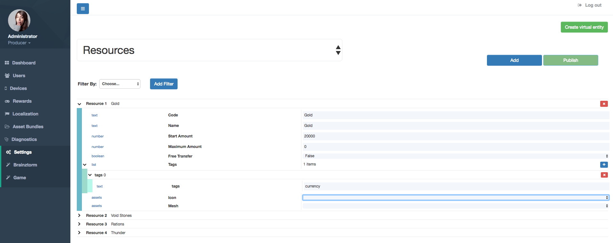

#################
Items Admin Tools
#################

To register items information, Admin Tools provide the Settings section. In this section, 
select the *Resources* option from the main dropdown. You will see a form like the image 
below, where you can create or modify items to use them in your game.

The form shown in the image above, has the following attributes:

- **Code** and **Name**: any string you want for identify and describe your item.
- **Start amount**: initial quantity of this item given to the player.
- **Maximum Amount**: maximum quantity of this item the player can collect. If zero, does not has maximum limit.
- **Free Transfer**: boolean to determine if the player can transfer amounts of this item to his/her friends.
- **Tags**: helps to categorize the item types. e.g.: currency.
- **Icon**: an asset path or asset bundle for the image that represents this item within the game. 
- **Mesh**: an asset path or asset bundle for the mesh that represents this item within the game. 