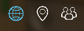

#############
Leaderbopards
#############

For working with Leaderboards first you need to set the provider URLs through 
Settings -> Brainztorm -> Cache Settings. See the image below: 

.. image:: images/cache_settings.png
When a developer need to show leaderboards only need to active the module in Unity Editor in the menu option 
Brainztorm > Settings. This action active the comunication to backend to initiualize and get the information 
in a "PubSub" communication with Redis's provider that store in real time the position rank of all users.

.. image:: images/leaderboards_game.png

The icons in this example is: Global, Country and Friends. 

.. image:: images/leaderboards_game_global.png
.. image:: images/leaderboards_game_country.png

When you need to update the position in the leaderboard of one user the developer need to manually update 
by server process.
