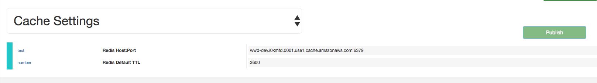

#############
Leaderboards
#############

For working with Leaderboards first you need to set the provider URLs through 
Settings -> Brainztorm -> Cache Settings. See the image below: 


When a developer need to show leaderboards only need to active the module in Unity Editor in the menu option 
Brainztorm > Settings. This action active the comunication to backend to initiualize and get the information 
in a "PubSub" communication with Redis's provider that store in real time the position rank of all users.


The icons in this example is: Global, Country and Friends. 

.. image:: images/leaderboards_game_tabs.png


.. image:: images/leaderboards_game_country.png
.. image:: images/leaderboards_game_friends.png


Tansactions
===========

```javascript
  //request global
  {"ranking":"global","type":"GetRanking"}
``` 

```javascript
  //request country
  {"ranking":"country","type":"GetRanking"}
```

```javascript
  //request social network friends
  {"ranking":"social","type":"GetRanking"}
```

```javascript
  //response
  {
      "type": "GetRanking",
      "pos": 1,
      "data": {
        "ranking": [
          {
            "position": 1,
            "user": "Muison Wacho",
            "value": 35739,
            "player": false,
            "picture": "",
            "trend": 0,
            "layer": 5,
            "online": false
          },
          {
            "position": 2,
            "user": "uro",
            "value": 30105,
            "player": false,
            "picture": "",
            "trend": 2,
            "layer": 5,
            "online": false
          },
          {
            "position": 3,
            "user": "oichi",
            "value": 5060,
            "player": false,
            "picture": "",
            "trend": 0,
            "layer": 5,
            "online": false
          },
          {
            "position": 4,
            "user": "asdadsadasdad",
            "value": 5035,
            "player": false,
            "picture": "",
            "trend": 1,
            "layer": 5,
            "online": false
          },
          {
            "position": 5,
            "user": "iPadCommander",
            "value": 5000,
            "player": false,
            "picture": "",
            "trend": 1,
            "layer": 5,
            "online": false
          },
          {
            "position": 74,
            "user": "twistedxtra",
            "value": 150,
            "player": true,
            "picture": "",
            "trend": 2,
            "layer": 1,
            "online": true
          }
        ]
      }
    }
``` 
   
When you need to update the position in the leaderboard of one user the developer need to manually update 
by server process.

