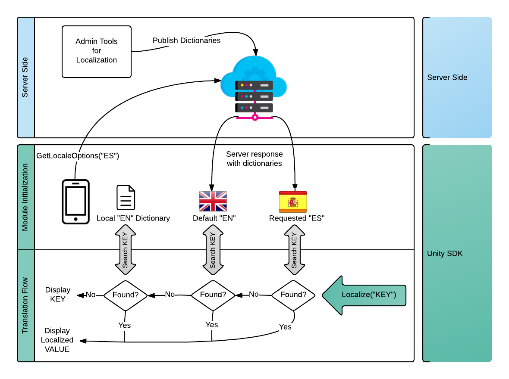

############
Localization
############

************
Introduction
************
Localization is part of the `Brainztorm Core Modules`_. It facilitates the internationalization of a game by providing dictionaries to reference keys and provide their localized content. Basically, these dictionaries are JSON files for each language you need to support. These JSON files are composed by key-value pairs where a *key* is the attribute referenced in the scripts, and *value* represents the translation in the corresponding language. A common dictionary looks like:

.. code-block:: javascript

    //EmbeddedLocalizationDictionary.json
    {
        "BRAINZTORM_DAILY_MISSIONS_COMPLETED_TEXT": "Completed {0}/{1}",
        "BRAINZTORM_ERROR_ASSET_LOADING": "There was a problem downloading a game file ''{0}''.",
        "BRAINZTORM_ERROR_COMMUNICATION_INVALID_RESPONSE": "Error connecting to the server (Invalid response).",
        "BRAINZTORM_ERROR_COMMUNICATION_NO_INTERNET": "We couldn't reach our server, please check your internet connection",
        ...
    }

As you can see in the above snippet, it is possible to make use of parameter specifiers in the *value part* of the dictionary to change the text dynamically.

The Localization flow is described in the following diagram:

*******
Content
*******
.. toctree::
    :maxdepth: 3

    client.rst
    server.rst

.. _Brainztorm Core Modules: #
