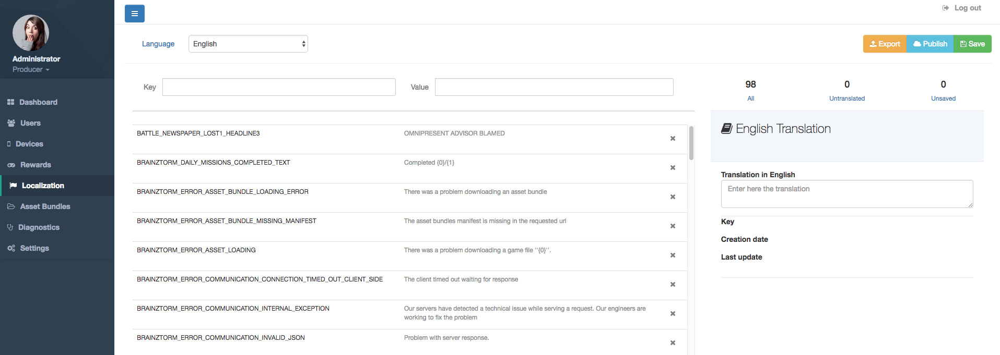

########################
Localization Admin Tools
########################

Admin Tools has a straightforward Localization component.

As observed in the above image, you has a simply key-value pairs editor where you can:

- Select a language.
- Filtering keys or values.
- Add new keys.
- Delete a key-value pair.
- Edit a value translation.
- See the amount of untraslated keys.
- See the amount of unsaved pairs.
- Export dictionaries to JSON.
- Publish dictionary to production.
- Save dictionary without publish.

