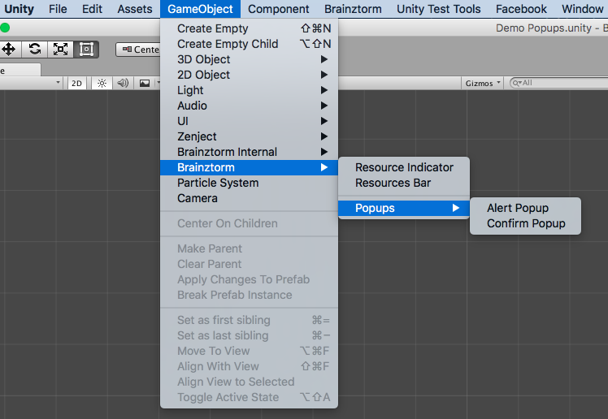

################
Popups Unity SDK
################

`API Reference`_

**********
How to use
**********
Popups component is a core module so it doesn't need to be activated. To use this component 
it's necessary to create an instance from popup class you want to display, and show it 
through the :code:`IPopupsDisplayer` interface:

.. code-block:: c#

    [Inject]
    private IPopupsDisplayer popUpDisplayer;

    private void ShowSimplePopup()
    {
        SimplePopupData popupData = new SimplePopupData();
        popupData.TitleLabel.Text.SetPlainText("Basic Popup Title");
        popupData.DescriptionLabel.Text.SetPlainText("Basic Popup Description");

        popupData.AcceptButton.IsEnabled = true;
        popupData.AcceptButton.Label.Text.SetPlainText("Accept");

        popupData.DeclineButton.IsEnabled = true;
        popupData.DeclineButton.Label.Text.SetPlainText("Decline");

        popUpDisplayer.OpenOrEnqueue(popupData);
    }

The above snippet produces the following popup:

.. image:: images/basic_popup_example.png

Creating a Custom Popup
=======================

.. warning::

    Although it's possible modify directly the built-in popups prefabs, this is 
    considered a bad practice, because your changes could be overwriten and dropped 
    if Brainztorm is updated. Instead, you can make a copy in your own assets directory.

To create customized popups, you have to create at least two scripts:

* An inherited class from :code:`SimplePopupData` that represents the popup's characteristics.
* A controller class extended from :code:`PopupDataHandlerBase<T>`.

This controller class must to receive your custom :code:`SimplePopupData` implementation. 
Look the code below:

.. code-block:: c#

    //ExamplePopupData.cs
    public class ExamplePopupData: SimplePopupData
    {
        //Popup properties definition
    }

    //ExamplePopupHandler.cs
    public class ExamplePopupHandler: PopupDataHandlerBase<ExamplePopupData>
    {
        protected override void Setup(ExamplePopupData popupData)
        {
            base.Setup(popupData);
        }
    }

Afterwards, the controller has to be attached to popup's root GameObject. 
When you attach the script, it automatically adds the components :code:`Popup`, 
:code:`ObjectActivator` and :code:`BackNavigationObject` needed for window navigation.

Brainztorm Popups Menu
----------------------
Brainztorm provides an easy way to create a simple popup in the scene that you can 
customize to your needs. To get this, use the menu GameObject - Brainztorm - Popups 
as shown in the next image:

Registering Common Popups
-------------------------
If you want your popup will be avaiable for all scenes in the game, the popup GameObject 
must to become into a Prefab and attach it to Popups Brainztorm Settings. Simply add a 
new slot and drag your popup prefab onto the avaiable slot. Look the image below:

.. image:: images/popup_prefabs_settings.png

Popups Components
=================
To construct popups, you need to know the following components provided by Brainztorm SDK:

PopUpLabelData
--------------
Text field within the popup, it can be enabled or disabled through the property 
:code:`IsEnabled`. Its text value can be a localized or static value assigned with the 
following methods respectively:

* :code:`Text.SetLocalizationKey(string localizationKey, params object[] replacements)` 
* :code:`Text.SetPlainText (string plainText, params object[] replacements)`

Its controller is :code:`PopupLabel`, this script must be attached to `Unity UI Text`_ 
Component (UnityEngine.UI.Text) that represents the *Label* in the popup.

.. code-block:: c#

    [Serializable]
    public class PopupLabelData
    {
        [SerializeField]
        private bool isEnabled = true;

        [SerializeField]
        private BrainztormString text = new BrainztormString();

        public bool IsEnabled
        {
            get { return isEnabled; }
            set { isEnabled = value; }
        }

        public BrainztormString Text
        {
            get { return text; }
            set { text = value; }
        }
    }

    [RequireComponent(typeof(Text))]
    [DisallowMultipleComponent]
    public class PopupLabel : MonoBehaviour
    {
        public void Setup(PopupLabelData data)
        {
            //Statements to setup component 
        }
    }

PopupInputFieldData
-------------------
Input text field within the popup, similary to :code:`PopupLabelData` component,
this can be enabled or disabled with :code:`ISEnabled` property, however, 
:code:`PopupInputFieldData` has two :code:`PopupLabelData` properties:

* :code:`FieldText`, text value typed by user.
* :code:`Placeholder`, watermark shown in the input field when is empty.

Its controller is :code:`PopupInputField`, this script must be attached to 
`Unity UI Input Field`_ Component (UnityEngine.UI.InputField) that represents 
the *Input Field* in the popup.

.. code-block:: c#

    [Serializable]
    public class PopupInputFieldData
    {
        [SerializeField]
        private bool isEnabled = true;

        [SerializeField]
        private PopupLabelData fieldText = new PopupLabelData();

        [SerializeField]
        private PopupLabelData placeHolder = new PopupLabelData();

        public bool IsEnabled
        {
            get { return isEnabled; }
            set { isEnabled = value; }
        }

        public PopupLabelData FieldText
        {
            get { return fieldText; }
        }

        public PopupLabelData Placeholder
        {
            get { return placeHolder; }
        }
    }

    [RequireComponent(typeof(Text))]
    [DisallowMultipleComponent]
    public class PopupInputField : MonoBehaviour
    {
        [SerializeField]
        private PopupLabel placeHolder;

        [SerializeField]
        private PopupLabel inputFieldText;

        [SerializeField]
        private bool autoSelect = true;

        public void Setup(PopupInputFieldData data)
        {
            placeHolder.Setup(data.Placeholder);
            inputFieldText.Setup(data.FieldText);
        }
    }

PopupButtonData
---------------
Button component, like the previous, can be enabled or disabled through :code:`IsEnabled` 
property, also it has the following properties:

* :code:`PopupLabelData`, the text shown in the button.
* :code:`PresCallback`, Action type event triggered when button is pressed.
* :code:`ClosePopupOnPress`, determine whether popup will be closed when button is pressed.

Its controller is :code:`PopupButton`, this script must be attached to `Unity UI Button`_ 
Component (UnityEngine.UI.Button) that represents the *Button* in the popup.

.. code-block:: c#

    [Serializable]
    public class PopupButtonData
    {
        [SerializeField]
        private bool isEnabled = true;

        [SerializeField]
        private bool closePopupOnPress = true;

        [SerializeField]
        private PopupLabelData label = new PopupLabelData ();

        public Action PressCallback;

        public bool IsEnabled
        {
            get { return isEnabled; }
            set { isEnabled = value; }
        }

        public bool ClosePopupOnPress
        {
            get { return closePopupOnPress; }
            set { closePopupOnPress = value; }
        }

        public PopupLabelData Label
        {
            get { return label; }
        }
    }

    [RequireComponent(typeof(Button))]
    [DisallowMultipleComponent]
    public class PopupButton : MonoBehaviour
    {
        [SerializeField]
        private PopupLabel label;

        private Button button;

        public void Setup(PopupButtonData data, Action close)
        {
            gameObject.SetActive(data.IsEnabled);
            SetupOnClick(data, close);
            SetupLabel(data);
        }

        private void SetupOnClick(PopupButtonData data, Action close)
        {
            //Statements to setup click event 
        }

        private void SetupLabel(PopupButtonData data)
        {
            //Statements to setup label 
        }
    }

.. _Unity UI Text: https://docs.unity3d.com/ScriptReference/UI.Text.html
.. _Unity UI Input Field: https://docs.unity3d.com/ScriptReference/UI.InputField.html
.. _Unity UI Button: https://docs.unity3d.com/ScriptReference/UI.Button.html