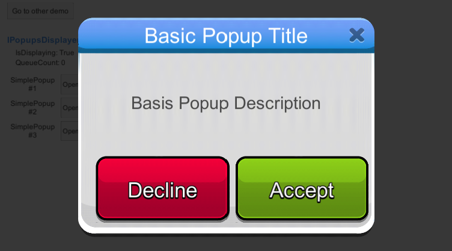
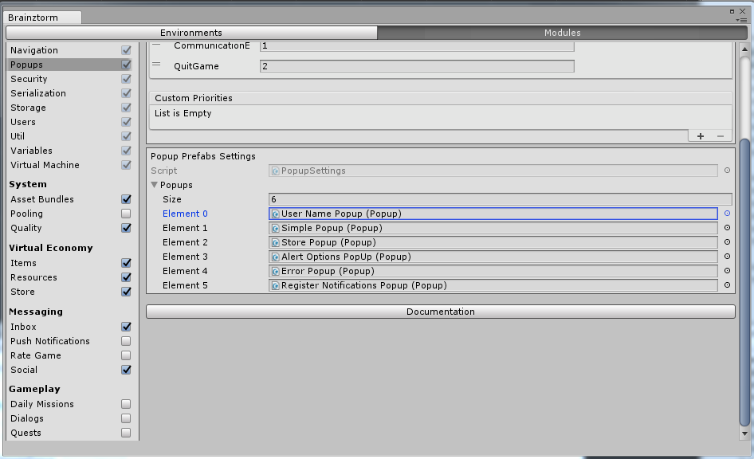

################
Popups Unity SDK
################

`API Reference`_

**********
How to use
**********
Popups component is a core module so it doesn't need to be activated. To use this component 
it's necessary to create an instance from popup class you want to display, and show it 
through the :code:`IPopupsDisplayer` interface:

.. code-block:: c#

    [Inject]
    private IPopupsDisplayer popUpDisplayer;

    private void ShowSimplePopup()
    {
        SimplePopupData popupData = new SimplePopupData();
        popupData.TitleLabel.Text.SetPlainText("Basic Popup Title");
        popupData.DescriptionLabel.Text.SetPlainText("Basic Popup Description");

        popupData.AcceptButton.IsEnabled = true;
        popupData.AcceptButton.Label.Text.SetPlainText("Accept");

        popupData.DeclineButton.IsEnabled = true;
        popupData.DeclineButton.Label.Text.SetPlainText("Decline");

        popUpDisplayer.OpenOrEnqueue(popupData);
    }

The above snippet produces the following popup:

You can create your own customized popups and also modify built-in popups' skin from Editor. 
To create customized popups, you have to create an inherit class from :code:`SimplePopupData` 
class, and a type popup's controller that will be attached to customized popup's GameObject. 
Look the code below:

.. code-block:: c#

  public class ExamplePopupData: SimplePopupData
  {
    //
  }

  public class ExamplePopupHandler: PopupDataHandlerBase<ExamplePopupData>
  {
      protected override void Setup(ExamplePopupData popupData)
      {
          base.Setup(popupData);
      }
  }

Una vez creado el popup, al momento de agregar el controlador, esté añadira automaticamente los
componentes :code:`Popup`, :code:`ObjectActivator` y :code:`BackNavigationObject` los cuales son importantes para la navegación de las
ventanas. Acto seguido el prefab debe agregarse a la lista de popups de Brainztorm que están
disponibles en el juego:

Componentes de los Popups
-------------------------

Para construir los popups, es necesario hacerlo teniendo en cuenta los siguientes componentes
que provee el SDK:

PopUpLabelData.cs
^^^^^^^^^^^^^^^^^
Campo de texto estático dentro del popup, puede activarse o desactivarse mediante el campo *IsEnabled*,
Su texto puede ser un valor localizado o un texto estático, el cual puede asignarse mediante los
métodos *Text.SetLocalizationKey (string localizationKey, params object[] replacements)* o
*Text.SetPlainText (string plainText, params object[] replacements)*.

Su controlador es *PopupLabel.cs* y es el script que se debe agregar al componente de texto de
Unity (UnityEngine.UI.Text) que quiere representar el Label dentro del popup.

.. code-block:: c#

	[Serializable]
	public class PopupLabelData
	{
		[SerializeField]
		private bool isEnabled = true;

		[SerializeField]
		private BrainztormString text = new BrainztormString();

		public bool IsEnabled
		{
			get { return isEnabled; }
			set { isEnabled = value; }
		}

		public BrainztormString Text
		{
			get { return text; }
			set { text = value; }
		}
	}

	[RequireComponent(typeof(Text))]
	[DisallowMultipleComponent]
	public class PopupLabel : MonoBehaviour
	{
		public void Setup(PopupLabelData data)
		{
      //
		}
	}

PopupInputFieldData.cs
^^^^^^^^^^^^^^^^^^^^^^
Componente de texto que el usuario ingresa por pantalla, al igual que el componente
PopupLabelData, este puede activarse o desactivarse desde la propiedad *IsEnabled*,
sin embargo, este posee dos propiedades PopupLabelData, uno es el componente *FieldText*,
que es el texto que el usuario ingresa desde el controlador, y la propiedad *Placeholder*,
que es la marca de agua que se muestra en el campo de texto cuando este está vacío.

Su controlador es *PopupInputField.cs* y es el script que se debe agregar al componente de input de
Unity (UnityEngine.UI.InputField) que quiera representar el campo de texto dentro del popup.

.. code-block:: c#

	[Serializable]
	public class PopupInputFieldData
	{
		[SerializeField]
		private bool isEnabled = true;

		[SerializeField]
		private PopupLabelData fieldText = new PopupLabelData();

		[SerializeField]
		private PopupLabelData placeHolder = new PopupLabelData();

		public bool IsEnabled
		{
			get { return isEnabled; }
			set { isEnabled = value; }
		}

		public PopupLabelData FieldText
		{
			get { return fieldText; }
		}

		public PopupLabelData Placeholder
		{
			get { return placeHolder; }
		}
	}

  [RequireComponent(typeof(Text))]
  [DisallowMultipleComponent]
  public class PopupInputField : MonoBehaviour
  {
		[SerializeField]
		private PopupLabel placeHolder;

		[SerializeField]
		private PopupLabel inputFieldText;

		[SerializeField]
		private bool autoSelect = true;

    public void Setup(PopupInputFieldData data)
    {
			placeHolder.Setup(data.Placeholder);
			inputFieldText.Setup(data.FieldText);
    }
  }

PopupButtonData.cs
^^^^^^^^^^^^^^^^^^^^^^
Componente de tipo botón, como los demás componentes, puede habilitarse o inhabilitarse desde la propiedad
*IsEnabled*, además de esto, posee una propiedad PopupLabelData, que es el texto que contiene el botón, y una propiedad
llamada *PresCallback*, un evento de tipo Action, que es la acción que se efectuará al presionar el botón; la propiedad
*ClosePopupOnPress*, tiene la función de cerrar o no el popup cuando el botón sea presionado.

Su controlador es *PopupButton.cs* y es el script que se debe agregar al componente de botón de
Unity (UnityEngine.UI.Button) que quiere representar el botón dentro del popup.

.. code-block:: c#

    [Serializable]
    public class PopupButtonData
    {
        [SerializeField]
        private bool isEnabled = true;
        [SerializeField]
        private bool closePopupOnPress = true;
        [SerializeField]
        private PopupLabelData label = new PopupLabelData ();

        public Action PressCallback;

        public bool IsEnabled
        {
            get { return isEnabled; }
            set { isEnabled = value; }
        }

        public bool ClosePopupOnPress
        {
            get { return closePopupOnPress; }
            set { closePopupOnPress = value; }
        }

        public PopupLabelData Label
        {
            get { return label; }
        }
    }

    [RequireComponent (typeof (Button))]
    [DisallowMultipleComponent]
    public class PopupButton : MonoBehaviour
    {
        [SerializeField]
        private PopupLabel label;

        private Button button;

        public void Setup (PopupButtonData data, Action close)
        {
            gameObject.SetActive (data.IsEnabled);
            SetupOnClick (data, close);
            SetupLabel (data);
        }

        private void SetupOnClick (PopupButtonData data, Action close)
        {
          //
        }

        private void SetupLabel (PopupButtonData data)
        {
          //
        }
    }
