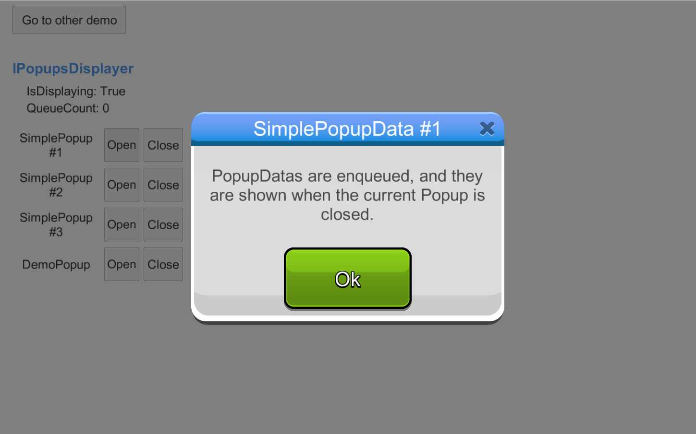

######
Popups
######

************
Introduction
************
Common graphic apps need to show dialogs to inform users about events, notifications, 
warnings, errors and so on. Games are not the exception to this rule. Therefore, 
Brainztorm Popups is designed to approach this need, it has a set of basic built-in 
dialogs you can customize to your needs.

*******
Content
*******
.. toctree::
    :maxdepth: 3

    client.rst