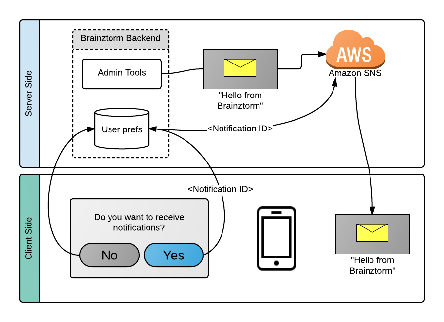

##################
Push Notifications
##################

************
Introduction
************
Push Notifications is a convenient way for sending messages to users without the game 
having to request the server or running a background service pulling continuously.

In first place you need to have and configure a push notifications provider, 
like `Amazon SNS`_. Afterwards, Brainztorm Admin Tools provide an easy way to 
configure the provider URL and also to send push notifications.

Each user will be prompted to allow receive messages through Push Notifications, 
if user accepts, the Brainztorm Unity SDK determines a device unique ID and sends 
to Brainztorm Backend to register in the Push Notifications provider.

The Push Notifications flow is described in the following diagram:

*******
Content
*******
.. toctree::
    :maxdepth: 3

    server.rst
    client.rst

.. _Amazon SNS: https://aws.amazon.com/sns
