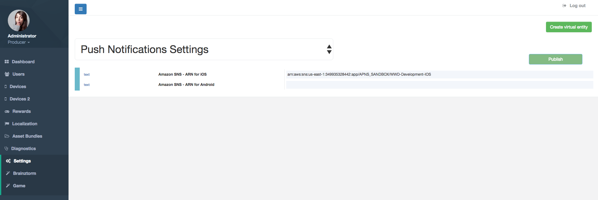
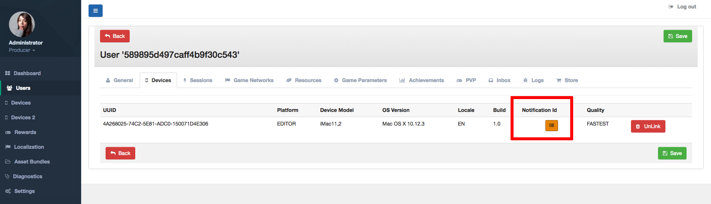
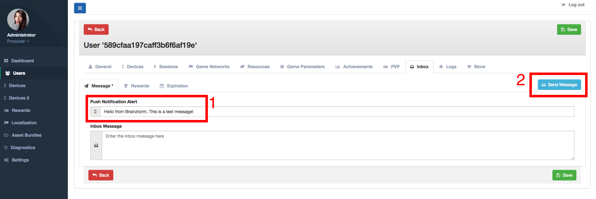

##############################
Push Notifications Admin Tools
##############################

For working with Push Notifications first you need to set the provider URLs through 
Settings -> Brainztorm -> Push Notifications Settings. See the image below: 

When a user install your game, he/she is prompted to autorize receiving Push Notifications, 
if the user accepts, the Notification ID for that device-installation is showed in Users 
section -> Devices tap (the ID is a long alphanumeric value, clicking the marked 
button in the image below opens a dialog where it's fully displayed).

After the provider URLs have been configured and the users have accepted to receive 
messages through Push Notifications, you can send messages per-user using the 
Inbox tap in Users section:

