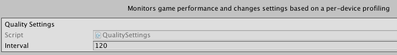

#################
Quality Unity SDK
#################

`API Reference`_

**********
How to use
**********
For using this module, first you need activate it in `Brainztorm Settings Menu`_. 
After, in your code you can access the static members through the provided class 
:code:`Brainztorm.Quality`.

.. note::

    For debugging purposes, it's recommended you activate the Quality Log in the core 
    module Logging, through the `Brainztorm Settings Menu`_.

Setting recommended quality
===========================
During module initialization, it automatically fetch from the server the recommended quality
for the current device.
If you activated the Quality Logging, you can see the entire logs in Unity Console showing the 
initial request and response containing the :code:`GetQuality` type as follow:

.. code-block:: javascript

    //Request
    {
        "UUID": "<UUID>",
        "start": true,
        "transactions": [
            ...
            {
                "pos": 8,
                "data": {
                    "type": "GetQuality"
                },
                "elapsedTime": 0
            }
        ]
    }

    //Response
    {
        "code": "NoError",
        "data": [
            ...
            {
                "type": "GetQuality",
                "pos": 8,
                "data": {
                    "quality": 4,
                    "optimal": 2,
                    "resolution": 0.25,
                    "criticalFpsThreshold": 10
                }
            }
        ]
    }

The respsonse data means:

- **quality**: is the current quality in the game.
- **optimal**: is the recommended quality by Brainztorm.
- **resolution**: is the recommended resolution by Brainztorm.
- **criticalFpsThreshold**: threshold when FPS becomes critical for good game performance.

Using Quality API
=================
:code:`Brainztorm.Quality` provide the following members to interact with the module:

Read-only properties: :code:`CurrentQuality`, :code:`OptimalQuality`, :code:`Resolution` 
and :code:`IsReady`.

.. Methods:

.. - :code:`SetQuality`: changes the current quality and optionally save change in the server.

Event types:

- :code:`OnReady`: executes when module is completely loaded.
- :code:`OnQualityChanged`: fired after quality has been changed by a response from server.
- :code:`OnDeviceNotSupported`: if response from server establish that current device is unsupported, this method will be triggered. 

We strongly recommend take advantage of OnReady event for accessing the module properties. 
This ensure the response from server is done and the module has set the current quality 
and resolution. Look the following example:

.. code-block:: c#

    using UnityEngine;
    using System.Collections;
    using BzQuality = Brainztorm.Quality;

    public class ExampleClass : MonoBehaviour 
    {
        BzQuality.OnReady += OnQualityReady;

        private void OnQualityReady()
        {
            Debug.Log("Current Quality is: " + BzQuality.CurrentQuality);
            Debug.Log("Optimal Quality is: " + BzQuality.OptimalQuality);
            Debug.Log("Resolution is: " + BzQuality.Resolution);
        }
    }

.. All the "Set preferred quality" section is commented
.. 
    Set preferred quality
    =====================
    Gamers can set the quality level overwriting the recommended by Brainztorm. If you choose 
    provide your players with this feature, use the :code:`SetQuality` method.

    .. code-block:: c#

        //Establish FAST quality
        Brainztorm.Quality.SetQuality(1);

    The default behaviour of :code:`SetQuality` method don't send this change to the Server. 
    For persisting the chosen quality level in Backend, pass true as 2nd parameter.

    .. code-block:: c#

        //Establish FAST quality and persist in backend
        Brainztorm.Quality.SetQuality(1, true);

    The quality level is sent to Backend through the Communications module. The typical JSON 
    payload looks like: 

    .. code-block:: javascript

        Host: demo.brainztorm.com/v1/user/execute/<sessionId>

        {
            "UUID": "<UUID>",
            "start": false,
            "transactions": [
                {
                "pos": 0,
                "data": {
                    "quality": 2,
                    "type": "SetQuality"
                },
                "elapsedTime": 0
                }
            ]
        }

Quality Profiling
=================
An important feature in Quality module is profiling. By this feature you can get vital 
information about how your game behave across different devices. Profiling consist in 
periodically send data to Backend for you can analize and take actions to improve your game. 
This data include information of frames, scene, criticals, screen resolution and quality level.

You can set the interval in seconds for sending data to Backend through 
*Brainztorm Settings Menu -> Modules -> Quality*. The following image shows a 120 seconds interval.

Each time the interval reaches, it send data to the Server as follow:

.. code-block:: javascript

    Host: demo.brainztorm.com/v1/user/execute/<sessionId>

    {
        "UUID": "<UUID>",
        "start": false,
        "transactions": [
            {
                "pos": 0,
                "data": {
                    "frames": 4073,
                    "time": 120,
                    "type": "SendQuality",
                    "scene": "Demo Quality",
                    "criticals": 0,
                    "resolution": 0.25,
                    "qualityLevel": 2
                },
                "elapsedTime": 0
            }
        ]
    }

.. _API Reference: #
.. _Brainztorm Settings Menu: #