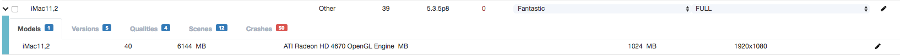
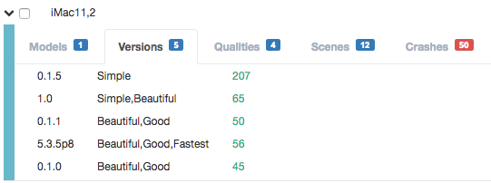
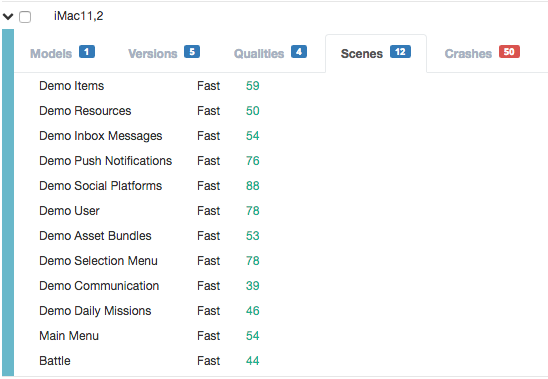

###################
Quality Admin Tools
###################

You can manage recommended per-device qualities and resolutions preferences 
through Devices section.

.. image:: images/at_devices_dashboard.png

Observe the *Quality* and *Resolution* columns, they provide dropdowns to set default 
values for each type of device. The available values for each one is as follow:

===========  =====  =======  =====
      Quality         Resolution
------------------  --------------
 Name        Value  Name     Value
===========  =====  =======  =====
Fastest      0      FULL     1
Fast         1      HALF     0.5
Simple       2      QUARTER  0.25
Good         3
Beautiful    4    
Fantastic    5
Unsupported  -1
===========  =====  =======  =====

*****************************
Quality Profiling Information
*****************************
If you expand the device row, you will find detailed information about it. With this 
information you can optimize your game focusing target the platforms, devices 
models or scenes that are badly affecting performance. This information 
is arranged in the following taps:

Models
======
In this tap you can see information about device hardware.

Versions
========
This tap shows FPS information per quality level per build version of your game.

Qualities
=========
In this tap you find FPS information per quality level and resolution for this device.

.. image:: images/at_devices_details_qualities.png

Scenes
======
Here you get FPS information per game scene and its respective quality level.

The last tap you can find in this section refers to *Crashes*, but this is not related 
directly with Quality Module, you can find more information about it at `Errors`_ section.

.. _Errors: #
