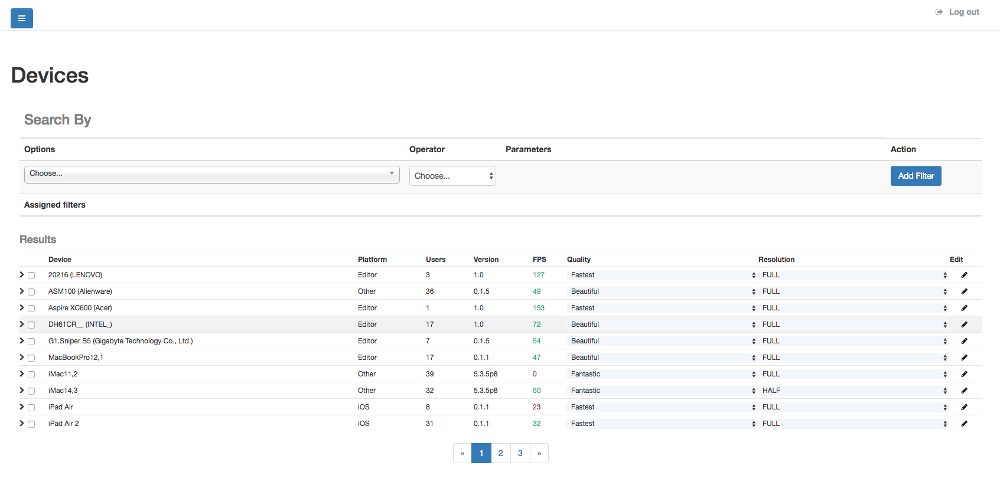
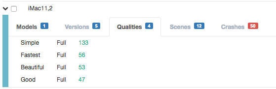

###################
Quality Admin Tools
###################

You can manage recommended per-device qualities and resolutions preferences 
through Devices section.

Observe the *Quality* and *Resolution* columns, they provide dropdowns to set default 
values for each type of device. The available values for each one is as follow:

===========  =====  =======  =====
      Quality         Resolution
------------------  --------------
 Name        Value  Name     Value
===========  =====  =======  =====
Fastest      0      FULL     1
Fast         1      HALF     0.5
Simple       2      QUARTER  0.25
Good         3
Beautiful    4    
Fantastic    5
Unsupported  -1
===========  =====  =======  =====

If you expand the device row, you will find detailed information about it:

With this information you can optimize your game approaching the right platforms, 
devices models or scenes that are badly affecting performance.