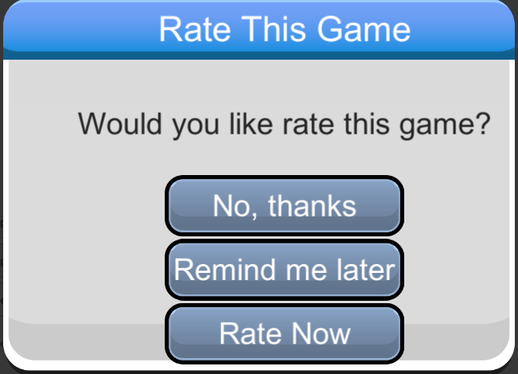

##################
RateGame Unity SDK
##################

`API Reference`_

**********
How to use
**********
For using this module, first you need activate it in `Brainztorm Settings Menu`_. 
After, in your code you can access the static members through the provided class 
:code:`Brainztorm.RateGame`.

.. note::

    For debugging purposes, it's recommended you activate the RateGame Log in the core 
    module Logging, through the `Brainztorm Settings Menu`_.

To prompt the rate popup, you have two options, force the appareance of the dialog or to ask 
the server to showing if it is convenient. The last one option is recommended by us, in order 
to avoid annoying the user.

.. code-block:: c#

    using UnityEngine;

    public class ExampleClass : MonoBehaviour 
    {
        public void AskToServer()
        {
            //This send the "NotifyRateAsk" transaction to Backend to verify Rate state.
            Brainztorm.RateGame.NotifyRateAsk(true);
        }
    }

The method :code:`NotifyRateAsk` sends the following request to he server:

.. code-block:: javascript

    //Request
    {
        "UUID": "<UUID>",
        "start": false,
        "transactions": [
            {
                "pos": 0,
                "data": {
                    "type": "NotifyRateAsk"
                },
                "elapsedTime": 0
            }
        ]
    }

If the user previously selected *Remind Me Later* and the *Remember Time* is elapsed then 
the server response will contain a *AskRate* type that will be procesed automatically by 
Brainztorm and will show up the Rate popup to the user:

.. code-block:: javascript

    //Response
    {
        "code": "NoError",
        "data": [
            {
                "type": "NotifyRateAsk",
                "pos": 0,
                "data": []
            },
            {
                "type": "AskRate",
                "pos": -1,
                "data": {
                    "url": "editor://rate-me"
                }
            }
        ]
    }

This popup will be a Native dialog depending the running platform, the image below 
is the default appearance in the Unity Editor:

When the user selects an option from the Rate popup, the :code:`NotifyRateAnswer` request 
is enqueued to be sended in the next transaction to the server. This request carries the 
answer the user selects from the Rate popup. These answer options are:

- Rated = 1
- RemindMeLater = 2
- NoThanks = 3

If you activated the RateGame Logging, you can see the logs in Unity Console showing the 
request and response containing the :code:`NotifyRateAnswer` type as follow:

.. code-block:: javascript

    //Request
    {
        "UUID": "<UUID>",
        "start": false,
        "transactions": [
            {
                "pos": 0,
                "data": {
                    "answer": 1,
                    "type": "NotifyRateAnswer"
                },
                "elapsedTime": 0
            }
        ]
    }

    //Response
    {
        "code": "NoError",
        "data": [
            {
                "type": "NotifyRateAnswer",
                "pos": 0,
                "data": []
            }
        ]
    }

RateGame API
============
:code:`Brainztorm.RateGame` provide the following members to interact with the module:

Properties:

- :code:`Logger`: read-only property that returns the own logger object for this module.

Methods:

- :code:`TryAskRate`: tries to show a dialog asking the user to rate the game.
- :code:`NotifyRateAsk`: ask to server if Rate dialog should be displayed.
- :code:`ForceAskRate`: force to show the dialog no matter the previous Rate state.

The snippet below shows a simple example:

.. code-block:: c#

    using UnityEngine;
    using BzRate = Brainztorm.RateGame;

    public class ExampleClass : MonoBehaviour 
    {
        public void TryAskForRate()
        {
            if (BzRate.TryAskRate(OnDialogClosed))
                BzRate.Logger.Log("The user was prompted for rate.");
            else
                BzRate.Logger.Log("Backend hasn't requested for a rate yet.");
        }

        private void OnDialogClosed()
        {
            BzRate.Logger.Log("An option was selected.");
        }
    }

.. _API Reference: #
.. _Brainztorm Settings Menu: #