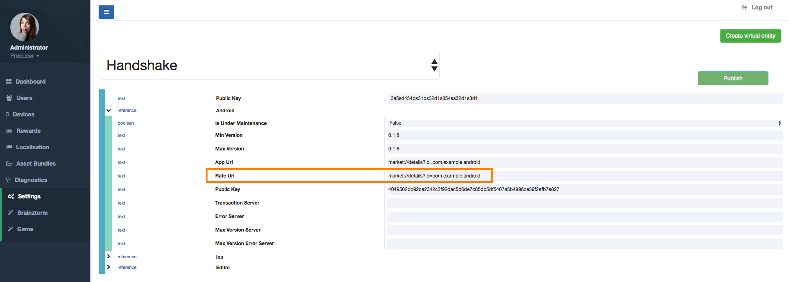
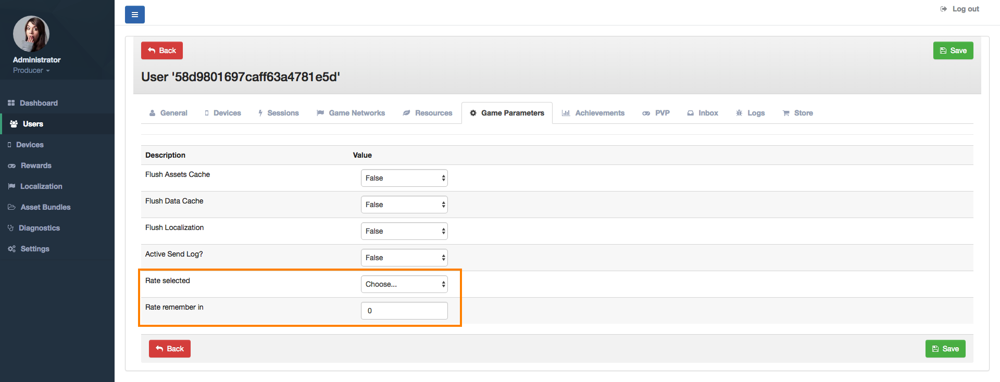

####################
RateGame Admin Tools
####################

You have to configure the Rate URL where the players will arrive when they accept rate your 
game through the Rate Popup within the game. To do this, open Settings section and selects 
Handshake settings from the main dropdown as shown in the image below. You will see the 
Android, iOS and Editor platforms. Editor refers to Unity Editor for settings when you are 
working in development. Fill the field *Rate URL* in the Android and iOS sections as you 
need. These URLs are generally the landing pages for your game in the App Store and Google Play.

You don't need anymore for configure the Rate functionality in the server side. Now, if 
you want to see the rating state for a determined user, go to the Users section, selects 
the user and the Game Parameters tap. As you see in the image below, its shown the current 
rating state and the timestamp date to remember the user for a rating request (if user 
previosly selected *Remember Later* when he/she was prompted).

