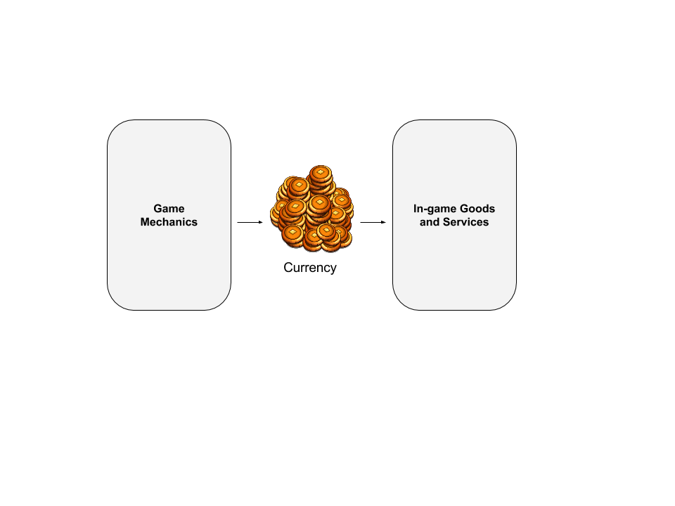

#########
Resources
#########

************
Introduction
************
Games often use currency to purchase in-game goods, unlocking levels or other services. These resources can be collected either through the game itself or purchased with real money.
We offer a way to handle resources transactions for any kind of game, keeping a secure record of every transaction on a player's account and providing integration with other modules.

*******
Content
*******
.. toctree::
   :maxdepth: 3

    server.rst
    client.rst
