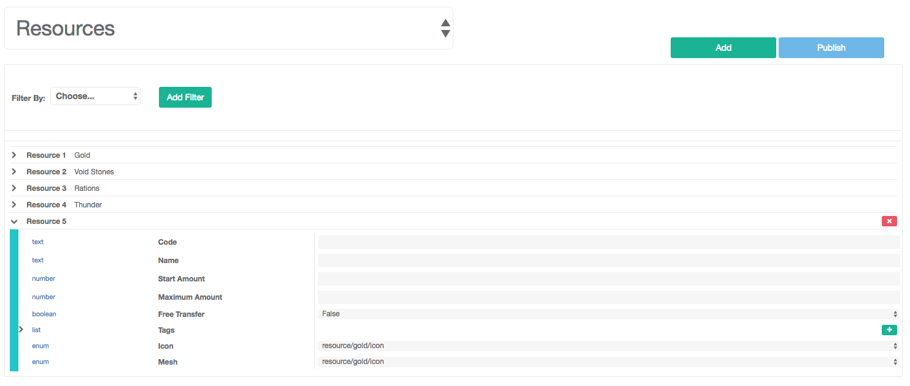
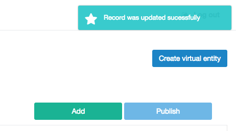
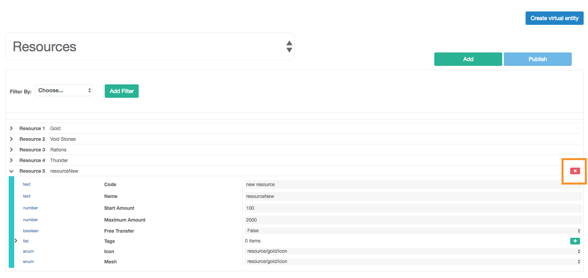

Resources
============

Introduction
------------

Provides an interface to manage the resources into the game. This module is integrated with the following components:

 - Initial Resources
 - User Resources

Initial Resources
^^^^^^^^^^^^^^^^^^
Provides an interface to manage the resources that will be use in the game.

.. image:: images/resources.png

The information available is:

- *Code*: Unique Identifier of the resource.
- *Name*: Name of the resource.
- *Start Amount*: Amount of the resource to start the game.
- *Maximum Amount*: Maximum Amount of the resource in the game.
- *Free Transfer*: Allow to transfer this resource to other player.
- *Tags*: List of tags to customize the resource.
- *Icon*: Assets that represent the resource.
- *Mesh*: Assets that represent the resource in 3D.

Add a new Resource
------------------

.. image:: images/resources.png

In the image we can see a button "Add" with this we can add a a new resource in the game. When you does the click into the button a new record empty is added in the las position of the list. 

When you finish to add the information of the new resource, we need to do click in the button "Publish" to save the new resource and will show success message.

Edit a Resource
------------------

.. image:: images/resources.png

When you select a resource and edit the information, we need to do click in the button "Publish" to save the changes of the resource and will show success message.

Delete a Resource
------------------

When you select a resource and open the information appear a red square "X" in the right side, we need to do click in this red square and finally you does click to the button "Publish" to delete the resource.

User Resources
^^^^^^^^^^^^^^^

Provide an interface to manage the resources of the user in the game.

.. image:: ../users/images/resources.png

The information available is:

- *Code*: Code to represent the resource.
- *Tags*: Tags to group the resources.
- *Amount*: Amount of the resource.
- *Maximum Amount*: Maximum amount of the resource.
