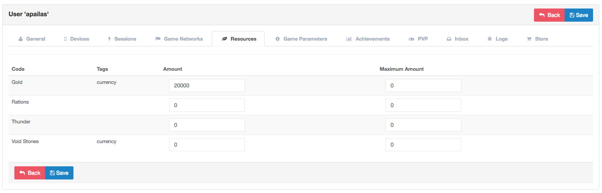

Resources
============

Introduction
------------

Provides an interface to manage the resources into the game. This module is integrated with the following components:

 - Initial Resources
 - User Resources

Initial Resources
^^^^^^^^^^^^^^^^^^
Provide an interface to manage the resources that will be use in the game.

.. image:: images/resources.png

The information available is:

- *Code*: Unique Identifier of the resource.
- *Name*: Name of the resource.
- *Start Amount*: Amount of the resource to start the game.
- *Maximum Amount*: Maximum Amount of the resource in the game.
- *Free Transfer*: Allow to transfer this resource to other player.
- *Tags*: List of tags to customize the resource.
- *Icon*: Assets that represent the resource.
- *Mesh*: Assets that represent the resource in 3D.

User Resources
^^^^^^^^^^^^^^^

Provide an interface to manage the resources of the user in the game.

The information available is:

- *Code*: Code to represent the resource.
- *Tags*: Tags to group the resources.
- *Amount*: Amount of the resource.
- *Maximum Amount*: Maximum amount of the resource.
