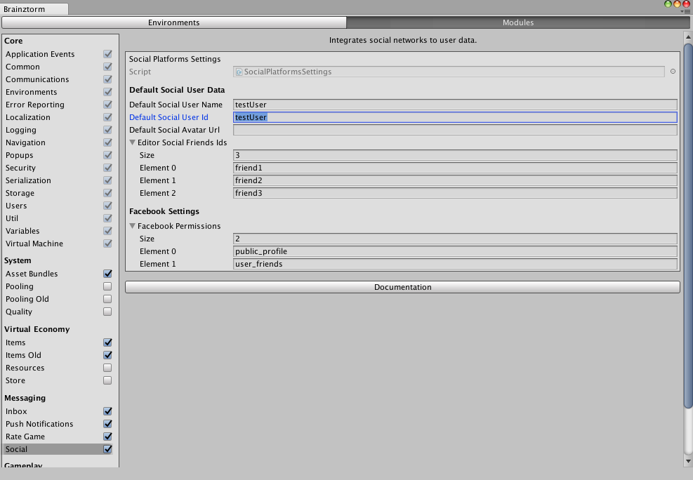

################
Social Unity SDK
################

`API Reference`_

**********
How to use
**********
For using this module, first you need activate it in `Brainztorm Settings Menu`_. 
After, in your code you can access the static members through the provided class 
:code:`Brainztorm.Social`.

.. note::

    For debugging purposes, it's recommended you activate the Social Log in the core 
    module Logging, through the `Brainztorm Settings Menu`_.

.. note::
    If you want to integrate Facebook to your game, please read the documentation 
    provided in `Facebook SDK for Unity`_ page.

You can configure certain variables for this module in the settings menu, 
as shown in the image below. 

The section *Default Social User Data* helps to you to mock the user data while 
you are working in the Unity Editor. 

The section *Facebook Settings* allows you to specify which facebook data 
provided by Facebook API you want to access.

How it works
============
When Social module is initializing, it follows these steps:

1 - Configures the Social Adapters like Facebook and those specific to current 
platform: GameCenter for iOS and GooglePlayGames for Android.

2 - Tries to authenticate the user with the specific platform Adapter.

3 - If Facebook adapter is enabled, it prompts the user to authenticate with this 
social network in order to fetch the profile data, avatar image, and friend list.

4 - If authentication is successful, upload the avatar image and friend list 
to the server.

Also, during module loading, it fetch the server automatically requesting the Friend 
Hash by each of the possible Social Networks, in order to know if friend list has 
changed since last login.

If authentication with certain Social Adapter works, then a transaction is sent to 
backend to register the Social Network in the user data. 

If you have the Social logger enabled you will see in the Unity console a 
transaction with types :code:`GetFriendHash` and :code:`LinkNetworkId` as follows:

.. code-block:: javascript

    //Request
    {
        "UUID": "<UUID>",
        "start": true,
        "transactions": [
            {
                "pos": 8,
                "data": {
                    "type": "GetFriendHash"
                },
                "elapsedTime": 0
            },
            {
                "pos": 9,
                "data": {
                    "data": {
                        "type": "GooglePlayGames",
                        "networkId": "",
                        "nickname": ""
                    },
                    "type": "LinkNetworkId"
                },
                "elapsedTime": 0
            }
        ]
    }

    //Response
    {
        "code": "NoError",
        "data": [
            {
                "type": "GetFriendHash",
                "pos": 8,
                "data": {
                    "hash": {
                        "GooglePlayGames": null,
                        "GameCenter": null,
                        "Facebook": null
                    }
                }
            },
            {
                "type": "LinkNetworkId",
                "pos": 9,
                "data": []
            }
        ]
    }

Using Social API
================
:code:`Brainztorm.BrainztormSocial` provide the following members to interact 
with the module:

Properties:

- :code:`IsCompleted`: read-only boolean to determine if authentication process is completely finished.
- :code:`UserInfo`: read-only property with the :code:`SocialUserInfoWrapper` data for current logged-in user.

Methods:

- :code:`GetUserInfoData`: returns the :code:`SocialUserInfoWrapper` data for the specified :code:`SocialNetwork` parameter. 
- :code:`Authenticate`: start authentication process with the specified :code:`SocialNetwork` parameter, if not specified, uses the default platform specific adapter (GameCenter, GooglePlayGames).
- :code:`IsLoggedIn`: verify if current user is authenticated with the specified :code:`SocialNetwork` parameter, if not specified, uses the default platform specific adapter (GameCenter, GooglePlayGames).
- :code:`LogOut`: closes the current user session.
- :code:`SubscribeToGotUserDataEvent`: subscribe a callback to be executed when the authentication succeded and the user data is fetched correctly.
- :code:`SubscribeToLogOutEvent`: subscribe a callback to be executed when the LogOut process is performed.
- :code:`UnsubscribeToGotUserDataEvent`: unsubscribe a previously subscribed callback with the method :code:`SubscribeToGotUserDataEvent`.
- :code:`UnsubscribeToLogOutEvent`: unsubscribe a previously subscribed callback with the method :code:`UnsubscribeToLogOutEvent`.

Events:

- :code:`OnSocialComplete`: executes when authentication process is completely finished..
- :code:`OnSentUserFriendsSucceeded`: fired when the friend list have been uploaded successfuly to the server.
- :code:`OnGotDefaultNetworkData`: triggered when the authentication process return the user data.

**Example 1**

The following code shows the use of *subscribe* and *unsubscribe* methods 
for handling the user data when it's obtained after authentication:

.. code-block:: c#

    using Brainztorm.SocialModule;
    using Brainztorm.Util;
    using UnityEngine;
    using UnityEngine.UI;

    public class SocialLogin : MonoBehaviour 
    {
        [SerializeField]
        private SocialNetwork socialNetwork;

        [SerializeField]
        private Text nickname;

        private void Start()
        {
            Brainztorm.Social.SubscribeToGotUserDataEvent(socialNetwork, SocialLocalUserFeatures);
            Brainztorm.Social.SubscribeToLogOutEvent(socialNetwork, Clear);
        }

        private void OnDestroy()
        {
            Brainztorm.Social.UnsubscribeToGotUserDataEvent(socialNetwork, SocialLocalUserFeatures);
            Brainztorm.Social.UnsubscribeToLogOutEvent(socialNetwork, Clear);
        }

        private void SocialLocalUserFeatures(IUserInfoWrapper localUser)
        {
            Debug.Log("User authenticated succeded in platform {0}", socialNetwork);
            Debug.Log("ID: {0}", localUser.NetworkId);
            Debug.Log("Name: {0}", localUser.UserName);

            nickname.text = localUser.UserName;
        }

        private void Clear()
        {
            nickname.text = "";
        }
    }

**Example 2**

The following code makes use of the methods :code:`Authenticate` and :code:`LogOut`:

.. code-block:: c#

    using Brainztorm.SocialModule;
    using Brainztorm.SocialModule.Views;
    using UnityEngine;
    using UnityEngine.UI;

    public class NetworkPlatformLoginCaller : MonoBehaviour
    {
        [SerializeField]
        private SocialNetwork network;

        [SerializeField]
        private Button button;

        [SerializeField]
        private Text buttonText;

        [SerializeField]
        private AvatarImage image;

        private void Start()
        {
            button.onClick.AddListener(LoginOrLogout);
            Brainztorm.Social.SubscribeToGotUserDataEvent(network, OnGotLocalUserData);
            Brainztorm.Social.SubscribeToLogOutEvent(network, Clean);

            SetButtonText();
        }

        private void OnDestroy()
        {
            Brainztorm.Social.UnsubscribeToGotUserDataEvent(network, OnGotLocalUserData);
            Brainztorm.Social.UnsubscribeToLogOutEvent(network, Clean);
        }

        private void OnGotLocalUserData(IUserInfoWrapper userInfo)
        {
            Debug.Log("ID: {0}", userInfo.NetworkId);
            Debug.Log("Name: {0}", userInfo.UserName);
            SetButtonText();
        }

        private void LoginOrLogout()
        {
            if (!)
                Brainztorm.Social.Authenticate(network);
            else
                Brainztorm.Social.LogOut(network);
        }

        private void Clean()
        {
            SetButtonText();
            image.Clear();
        }

        private void SetButtonText()
        {
            bool isLogged = Brainztorm.Social.IsLoggedIn(network);
            buttonText.text = isLogged ? "Log Out " + network : "Log in " + network;
        }
    }

.. _API Reference: #
.. _Brainztorm Settings Menu: #
.. _Facebook SDK for Unity: https://developers.facebook.com/docs/unity/