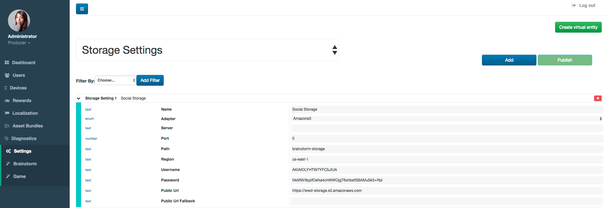
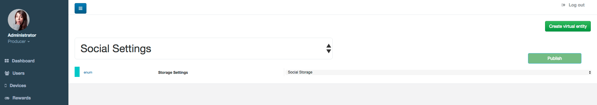
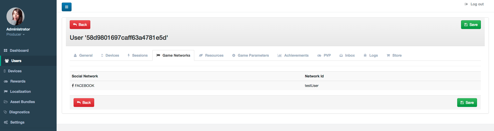

##################
Social Admin Tools
##################

***************
Social Settings
***************
In Admin Tools, first, you need to configure a storage container to save the 
profile images of your users. To do this, go to *Settings - Brainztorm* and from 
the main dropdown options, select *Storage Settings* and configure a Social Storage 
as shown in the image below:

After you set the Social Storage, select *Social Settings* from the main dropdown 
and assign the recently created Social Storage as shown in the image below:

Now, when your users make the authentication process with a social network, 
Brainztorm will save the profile images in the Social Storage, for using across 
the game experience.

*****************
Users Social Data
*****************
The Social Networks used by your users to Login are stored and displayed in 
the Users secion. Go to Users section, and select the user you want, navigate to the 
Game Networks tab and you will find the the information:

