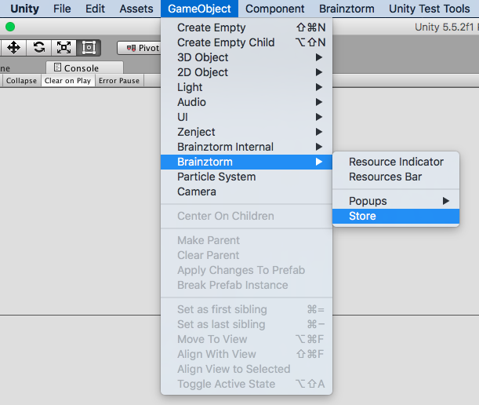
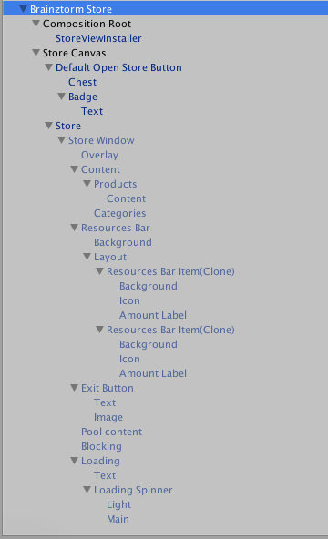
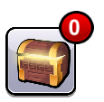

###############
Store Unity SDK
###############

`API Reference`_

**********
How to use
**********
For using this module, first you need activate it in `Brainztorm Settings Menu`_.

.. note::

    For debugging purposes, it's recommended you activate the Store Log in the core 
    module Logging, through the `Brainztorm Settings Menu`_.

The Store module has the following process:

1. During initialization phase, it sends an :code:`InitializeStore` transaction, 
to prepare (if needed) the App Store or Google Play for In App Purchases (IAP):

.. code-block:: javascript

    //Request
    {
        "UUID": "<UUID>",
        "start": false,
        "transactions": [
            {
                "pos": 2,
                "data": {
                    "type": "InitializeStore"
                },
                "elapsedTime": 0
            }
        ]
    }

    //Response
    {
        "code": "NoError",
        "data": [
            {
                "type": "InitializeStore",
                "pos": 2,
                "data": {
                    "iapReady": true,
                    "iasReady": true,
                    "count": 0
                }
            }
        ]
    }

2. When the user clicks the Store button, it sends a :code:`GetStoreProducts` transaction
for get the products list:

.. code-block:: javascript

    //Request
    {
        "UUID": "<UUID>",
        "start": false,
        "transactions": [
            {
                "pos": 0,
                "data": {
                    "hash": "",
                    "type": "GetStoreProducts"
                },
                "elapsedTime": 0
            }
        ]
    }

    //Response
    {
        "code": "NoError",
        "data": [
            {
                "type": "GetStoreProducts",
                "pos": 0,
                "data": {
                    "categories": [
                        {
                            "name": {
                                "lockey": "STORE_CATEGORY_1_5845AE824EF06"
                            },
                            "icon": "",
                            "identifier": "Resources",
                            "products": [
                                {
                                    "_id": {
                                        "$id": "5845ecaa97caff70097d8375"
                                    },
                                    "categoryId": {
                                        "$id": "5845ae8297caff67e5363999"
                                    },
                                    "code": "Gold",
                                    "icon": "",
                                    "name": {
                                        "lockey": "STORE_PRODUCT_1_5845ECAA3B72A"
                                    },
                                    "description": {
                                        "lockey": "STORE_PRODUCT_1_5845ECAA3BA4B"
                                    },
                                    "iap": null,
                                    "ias": {
                                        "type": "Resources",
                                        "code": {
                                            "$id": "548b1b359f30d8ad37e2ca04"
                                        },
                                        "amount": 1000
                                    },
                                    "requirements": [],
                                    "rewards": {
                                        "type": "Resources",
                                        "code": {
                                            "$id": "548b1b359f30d8ad37e2ca04"
                                        },
                                        "amount": 5
                                    },
                                    "viewTemplate": "Resources",
                                    "checksum": "e85ca9fabbd4bae0",
                                    "new": false,
                                    "available": true
                                }
                            ]
                        }
                    ],
                    "hash": "07d01707b497e58f/ddffb82d9c5e1917"
                }
            }
        ]
    }

Obtained this response, the store can be constructed and shown to the player.

Using Store API
===============
Store is a self-executing module by convenience design. For this reason, its API is so 
small, basicaly, the :code:`Brainztorm.Store` provide the following members to 
interact with the module:

Read-only properties: 

- :code:`IsReady`: read-only boolean indicating if the module is completely loaded.
- :code:`Logger`: returns the own logger object for this module.

Events:

- :code:`OnReady`, when the module is completely loaded.
- :code:`OnPurchaseSucceeded`, when a purchase transaction will end with success.

Creating a Store
================
An easy way to create a Store for your game is to use the provided GameObject Brainztorm 
Store menu option. This option creates the neccessary objects into the scene hierarchy and 
so the Store is ready to use with your server, afterwards you can customize as you like.

After using the menu above, the scene hierarchy looks like:

In the scene you will see a default button to open the store view.

To customize the button and the rest of the store, simply take a tour towards the game objects 
and change the corresponding sprites as you like.

Add products to Store
---------------------
Pending section...

..
    .. image:: images/store_settings.png

.. _API Reference: #
.. _Brainztorm Settings Menu: #