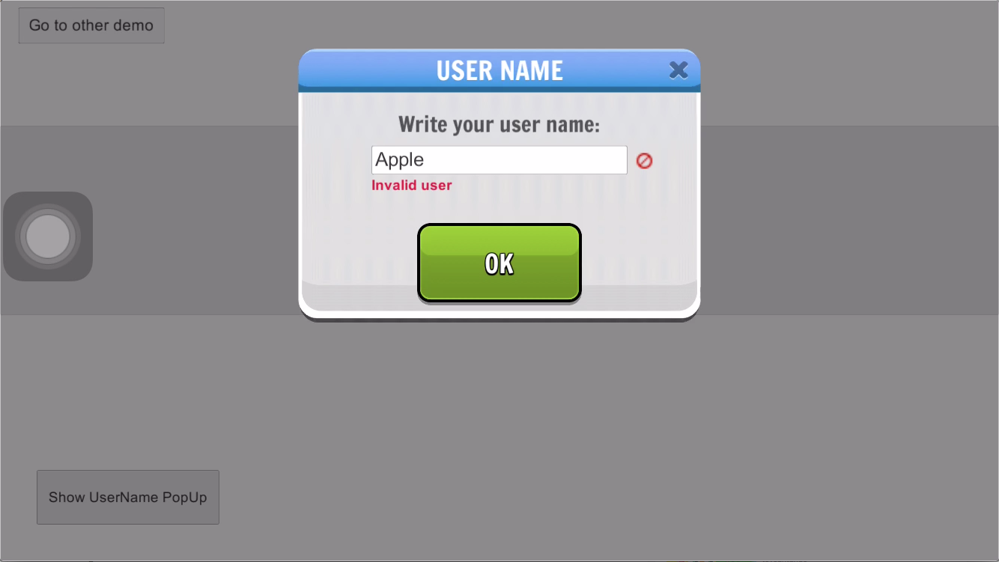

Client Communications
=====================

Introduction
------------
Allows to keep track of players, their devices, social networks and other useful information.
Also provides a unique way to identify players so other Brainztorm and game-specific components
can rely on it to achieve different goals.

.. image:: images/users.png

For example you can keep track of user's level, or unlocked characters. Most of Brainztorm components
like store, quests, daily missions, and more are user dependent.

How to use it
-------------
You can get the current user id through the *IUserIds* interface

.. code-block:: c#

  [Inject]
  private IUserIds userIds;

  private void LogUserIds()
  {
    // Logs device unique identifier
    Debug.Log(userIds.UUID);

    // Logs linked user id for this device
    Debug.Log(userIds.userId);
  }

The server knows the user id after the session is stablished, and neither transactions nor variables module need this id on your
data files to keep track of them.

Username
--------
You can prompt users to change their username at any time, you can do so through the *IUserNameChanger* interface. If the player has
a previously created username, this will be set as default value. Otherwise, the last linked social network id will be used as default.

.. code-block:: c#

  [Inject]
  private IUserNameChanger usernameChanger;

  private void PromptForUserName()
  {
    usernameChanger.Show(ContinueTutorial, SetGenericName);
  }

  private void ContinueTutorial()
  {
    //...
  }

  private void SetGenericName()
  {
    //...
  }

The username popup checks different criteria such as duplicated names or profanity filters to validate the current name, this happens after the
user stops typing for a small amount of time or once the submit button is pressed.

.. image:: images/sdk-profanity-true.png

The appropriate callback will be invoked once the username popup is dismissed.

Profanity Filter
----------------
Usernames, as well as other features, is constrained by a profanity filter. This filter defines a set of forbidden expressions which can't be used in game.
You can find this useful for brands or offensive words that could get the game rejected from application stores.

Social Networks
---------------
You can link social networks to user's game profile, doing so allows them to keep their progress on different
scenarios:

- Uninstalling and re-installing game again.
- One user using many devices.
- One device used by many users.

Also, you can access this information through the **ISocialManager** interface.

.. code-block:: c#

  [Inject]
  private ISocialManager social;

  private void LogNetworkData()
  {
      // Logs username on the selected social network
      Debug.Log(social.UserInfo.UserName);

      // Logs the unique networkId on the selected social network
      Debug.Log(social.UserInfo.NetworkId);

      Texture2D avatar = social.UserInfo.Avatar;
      // Show avatar
  }

How it works
------------
Once the session starts, a transaction request called **GetUserData** is sent together with the **TransactionStarter**. The transaction starter contains the device's
UUID and social network ids if any is available; as well as the last user id used in this device. The server searches for users linked with network ids, if none is found
it tries to find one that is linked to the current UUID. If the server fails to find a matching user, creates one and links it to the UUID.

.. image:: images/linking.png

If for any reason, the server finds an user conflict, a resolution screen is shown to the player and the dismissed user is errased.

