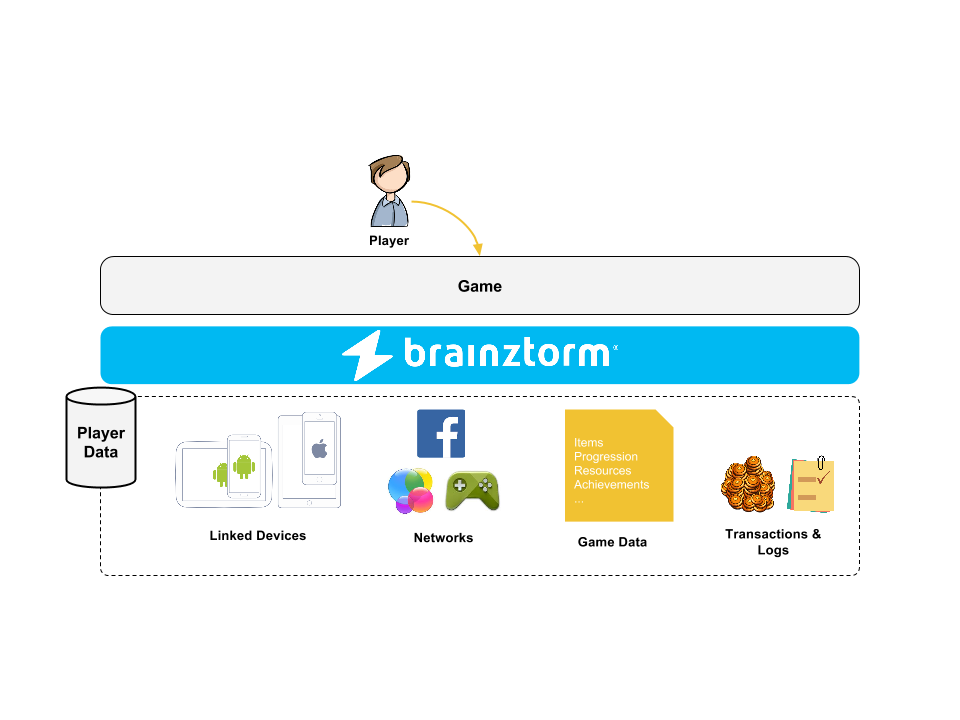

#####
Users
#####

************
Introduction
************
Allows to keep track of players, their devices, social networks and other useful information.
Also provides a unique way to identify players so other Brainztorm and game-specific components
can rely on it to achieve different goals.

For example you can keep track of user's level, or unlocked characters. Most of Brainztorm components
like store, quests, daily missions, and more are user dependent.

*******
Content
*******
.. toctree::
    :maxdepth: 3

    server.rst
    client.rst
