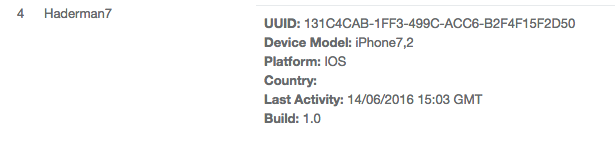
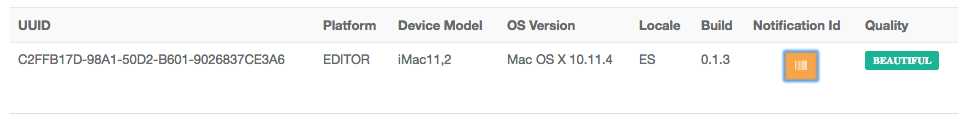
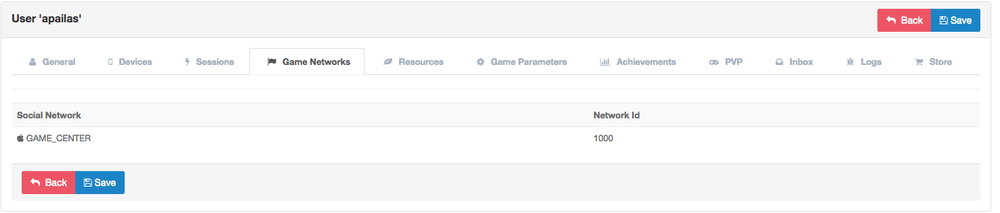
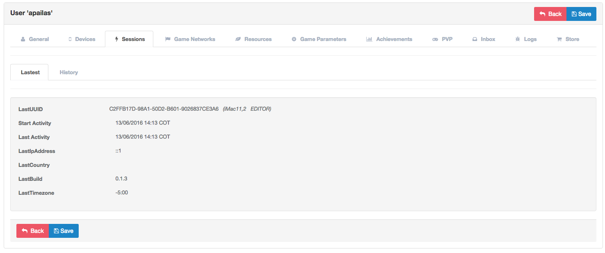
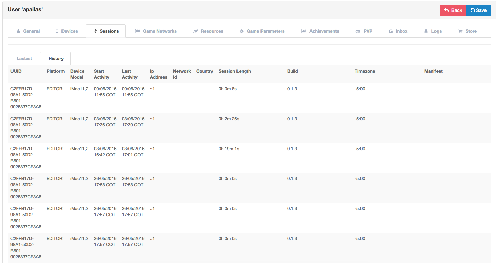
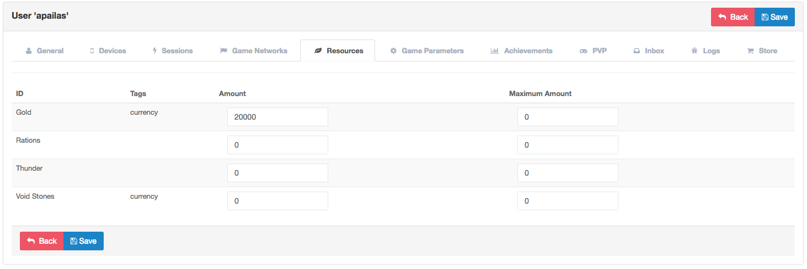
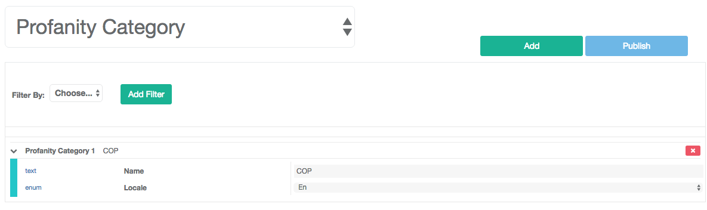
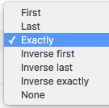
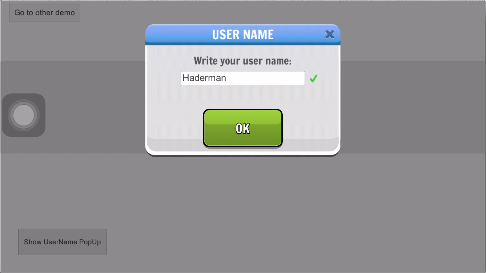
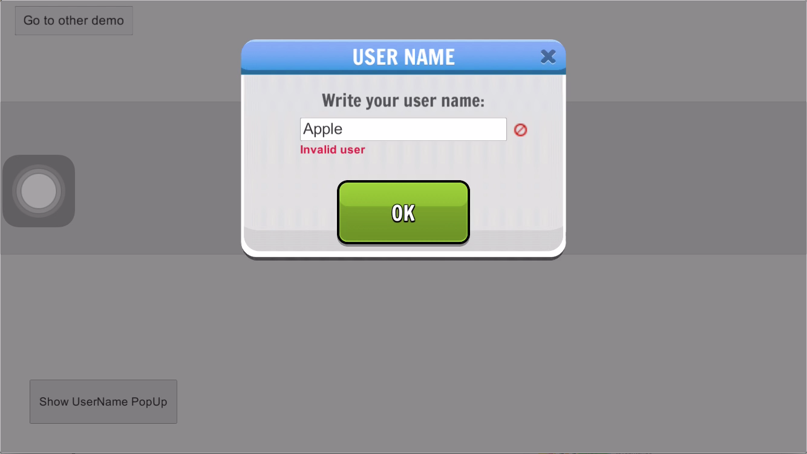

Introduction
============

It provides an interface for managing users and their devices to record useful
information for managing a game, recording data such as:

- Information about the device log on to the game.
- Unification of devices for social networking.
- Location by device user.
- Lifetime a user and their history logins.
- Registration logs of a device in the game.
- Management of banned users.
- Resource management game to a user.
- State of other modules such as:
 - Achievements
 - Resources
 - Store
 - Issues
 - Inbox

Devices
-------
When you log into the game, devices are sending all the information of the mobile
device hardware to the Brainztorm server linking it to a user.

The information stored in the device are:

- *UUID*: The Universal Unique Identifier of the mobile device.
- *Platform*: Operating system of the device mobile, such as: iOS, Android and default is Editor.
- *Device Model*: The model of registered device, such as iPhone 6.
- *OS Version*: The version of the mobile operating system.
- *Locale*: The language of the user device.
- *Build*: The build number of the game that is currently playing the user.
- *Notification ID*: A unique code required by Google/Apple to send push notifications to the mobile device.
- *Quality*: The quality profile being used by device according to a pre-selection or detected according to its hardware.
- *Timezone*: Timezone of the device.
- *Manifest*: Unity Cloudbuild information. 

Social Networks
---------------
Devices that belong to a user and are connected to supported social networks such as
Google Play, Game Center or Facebook, basic information is share to the Brainztorm backend
allowing a user to start session using any of his registered networks without losing his game progress.

The information stored in the user are:
- *Social network*: Social netowkr conencted.
- *NetworkId*: Id único que representa el código del usuario en la red social.
- *Nickname*: Username in the social network.

The social networks available:
 - Google Play
 - Game Center
 - Facebook

Session
-------
Devices that belong to a user and are connected to a social network such as
Google Play, Game Center or Facebook, send information from your social network
and connects the user accounts that through your social network can a user have
multiple devices and not lose your progress in the game. 
Brainztorm allow to know the localization of the country by IP Address allowing group the users to use possible market strategies.

The information stored into the session are:

- *LastUUID*: The last UUID that logged.
- *Start Activity*: Time when you start login.
- *Last Activity*: Time when you logout.
- *LastIpAddress*: The last IP Address that logged.
- *LastCountry*: The last country that logged.
- *LastBuild*: The last version of the build that start logged
- *LastTimezone*: The last timezone that logged.

We can see a history of connections made during the game and from that device.

- *UUID*: UUID that logged.
- *Start Activity*: Time when you start login.
- *Last Activity*:  Time when you logout.
- *IpAddress*: IP Address that logged.
- *Country*: Country that logged.
- *Build*: Version of the build that start logged.
- *Timezone*: The last timezone that logged.

Resources
---------
Brainztorm allows resource management in a game with the ability to link these to users for easy handling. These can edit user resources in the game are registered by the resource module.

The fields in resources are:

- *Code*: Code to represent the resource.
- *Tags*: Tags to group the resources.
- *Amount*: Amount of the resource.
- *Maximum Amount*: Maximum amount of the resource.

Achievements
-------------
Brainztorm allows achievements management in a game with the ability to link these to users for easy handling.
These can edit user achievements in the game are registered by the achievements module.

PVP
----
Brainztorm can view the history of PVP (Player vs. Player) battles where registration enter conducted two have already registered users will see.

Inbox
------
Brainztorm offers the experience of being able to send notifications to users custom games or sending mass messages coming to your personal inbox.

Logs
-----
Brainztorm offers the experience of seeing a variety of logs for seguimineto errors in the game and to give more information to developers to fix them.

Store
-----
Brainztorm offers the experience to see products that can see each user as desired by the owners of the games and promotions criteria regions of the world.

Profanity Filter
----------------
Games should restrict by language words which are reserved or offensive that could cause a game to be closed or suspended. Brazintorm offers a profanity filter which allows feed and detect these words to avoid this mess by entering the name of a user or a game allowing chat easily avoid these legal problems.

Words can be categorized by language, to create / edit a group must enter "Profanity Category":

The fields in profanity category are:

- *Name*: Name to represent the category. 
- *Locale*: Locale language. 

To add a filter to the profanity filter should enter "Profanity Filters" which allows the filling of those words in a specific group.

.. image:: images/profanity-filters.png

The fields in profanity filters are:

- *Category*: Category of the filter. 
- *Type*: The type to apply the filter.
- *Value*: Value of the filter. 

Words can be represented in different types which allow amicably say whether to search for the word at the beginning or end of a frace / word or that word exactly.

- *First*: It indicates that you should start with the set value. Example: Start with the word "Apple".
- *Last*: It indicates that you should end with the set value. Example: End with the word "Apple".
- *Exactly*: It indicates that you should exactly the value. Example: Exactly the word "Apple" without case sensitive.
- *Inverse First*: It indicates that you should start with the set value. Example: Start with the word "محمد".
- *Inverse First*: It indicates that you should end with the set value. Example: End with the word "محمد".
- *Inverse Exactly*: It indicates that you should exactly the value. Example: Exactly the word "محمد".
- *None*: It indicates that you should exactly the value. Example: Exactly the word "Apple" with case sensitive.

When updating your username Brainztorm reviews the list profanity filter and see if it is a word that meets the criteria administered:

Valid:

Invalid:

