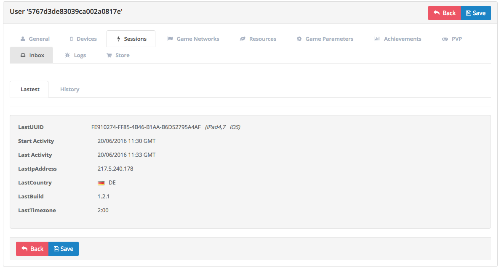

Introduction
============

It provides an interface for managing users and their devices to record useful
information for managing a game, recording data such as:

- Information about the device log on to the game.
- Unification of devices for social networking.
- Location by device user.
- Lifetime a user and their history logins.
- Registration logs of a device in the game.
- Management of banned users.
- Resource management game to a user.
- State of other modules such as:
 - Achievements
 - Resources
 - Store
 - Issues
 - Inbox

Devices
-------
When you log into the game, devices are sending all the information of the mobile
device hardware to the Brainztorm server linking it to a user.

.. image:: images/devices.png

The information stored in the device are:

- *UUID*: The Universal Unique Identifier of the mobile device.
- *Platform*: Operating system of the device mobile, such as: iOS, Android and default is Editor.
- *Device Model*: The model of registered device, such as iPhone 6.
- *OS Version*: The version of the mobile operating system.
- *Locale*: The language of the user device.
- *Build*: The build number of the game that is currently playing the user.
- *Notification ID*: A unique code required by Google/Apple to send push notifications to the mobile device.
- *Quality*: The quality profile being used by device according to a pre-selection or detected according to its hardware.

.. image:: images/devices2.png

Social Networks
---------------
Devices that belong to a user and are connected to supported social networks such as
Google Play, Game Center or Facebook, basic information is share to the Brainztorm backend
allowing a user to start session using any of his registered networks without losing his game progress.

.. image:: images/social.png

Session
-------
Devices that belong to a user and are connected to a social network such as
Google Play, Grame Center or Facebook, send information from your social network
and connects the user accounts that through your social network can a user have
multiple devices and not lose your progress in the game.

