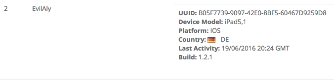

Introduction
============

It provides an interface for managing users and their devices to record useful
information for managing a game, recording data such as:

- Information about the device log on to the game.
- Unification of devices for social networking.
- Location by device user.
- Life time a user and their history logins.
- Registration logs of a device in the game.
- Management of banned users.
- Resource management game to a user.
- State of other modules such as:
 - Achievements
 - Resources
 - Store
 - Issues
 - Inbox

Devices
-------
When you log into the game devices are sending all the information of the mobile
device hardware server Brainztorm linking it to a user.

The information stored in the device are:

- *UUID*: The Universal Unique Identifier of the mobile device.
- *Platform*: Is dispotiivos mobile operating system, such as iOS, Android and default is Editor.
- *Device Model*: The model registered device, such as iPhone 6.
- *OS Version*: The version of the mobile operating system.
- *Locale*: The language you have set up the operating sitema having the mobile device.
- *Build*: The build number that has regsitrado the game, with this information you can look that version of the game has every mobile device.
- *Notification ID*: The unique code to send push notifications to mobile device.
- *Quality*: The quality of images that have the game on the mobile device.

.. image:: images/devices2.png

Social Networks
---------------
Devices that belong to a user and are connected to a social network such as
Google Play, Grame Center or Facebook, send information from your social network
and connects the user accounts that through your social network can a user have
multiple devices and not lose your progress in the game.

.. image:: images/social.png

Session
---------------
Devices that belong to a user and are connected to a social network such as
Google Play, Grame Center or Facebook, send information from your social network
and connects the user accounts that through your social network can a user have
multiple devices and not lose your progress in the game.

.. image:: images/session.png
