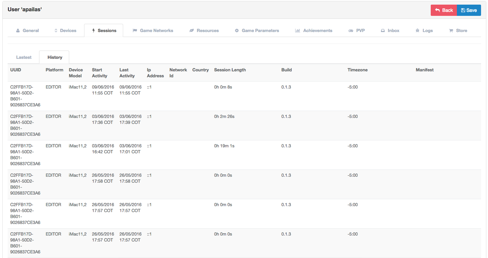
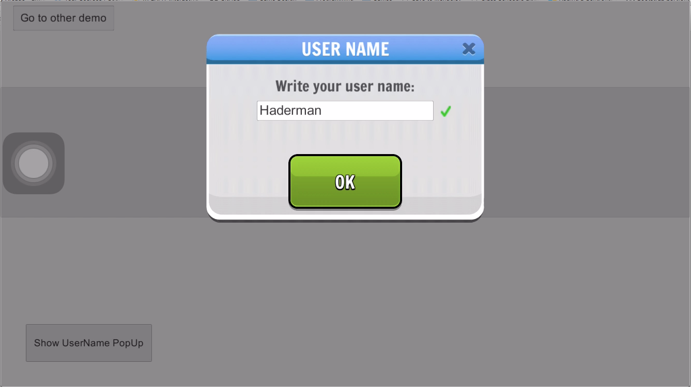

Server Users
============

Introduction
------------

Provides an interface to manage users and their devices. Also, collects useful
information and allows you to perform actions such as:

- Device login on to the game.
- Unified devices for social networking.
- Location by user device.
- Play session history.
- Banned users management.
- Resource management.

This module is integrated with the following components:

 - Achievements
 - Resources
 - Store
 - Issues
 - Inbox

Devices
^^^^^^^
When you log into the game, devices send hardware and OS information to the server, linking it to a user through
an unique device id.

.. image:: images/devices.png

The information available is:

- *UUID*: Universal Unique Identifier.
- *Platform*: Operating system, such as: iOS, Android, Windows, Editor, etc.
- *Device Model*: Model of the mobile device, such as iPhone 6.
- *OS Version*: Operating system version.
- *Locale*: Current language selected on the mobile device.
- *Build*: The build number of the game that is currently playing the user.
- *Notification ID*: A unique code required by Google/Apple to send push notifications to the mobile device.
- *Quality*: The quality profile used by the device, uses a prior selected value or detects the best option automatically according to the hardware performance.
- *Timezone*: Timezone of the device.
- *Manifest*: Unity Cloudbuild information.

.. image:: images/devices2.png

Social Networks
^^^^^^^^^^^^^^^
Devices that belong to a user and are connected to supported social networks like Google Play, Game Center or Facebook, send information to the server. This allows an user to login using any of his registered networks and continue with their prior game progress.

.. image:: images/social.png

- *Social network*: Social network type.
- *NetworkId*: Unique user id on the social network.
- *Nickname*: Username in the social network.

Supported social networks:
 - Google Play
 - Game Center
 - Facebook

Session
^^^^^^^
Each time the user starts the game, a connection is stablished with our server. We collect data related to this play session.

The country where the user is playing is tracked by IP address, allowing to group users by country or region. This information can be used for marketing purposes.

.. image:: images/session.png

- *LastUUID*: Unique id for the last device the user used.
- *Start Activity*: Time when the user started playing.
- *Last Activity*: Time when the user quitted the game.
- *LastIpAddress*: The last IP Address that logged.
- *LastCountry*: The last country the user played from.
- *LastBuild*: The last build version used.
- *LastTimezone*: The last timezone the user played from.

We can see a history of connections made for that user.

- *UUID*: UUID that logged.
- *Start Activity*: Time when you start login.
- *Last Activity*:  Time when you logout.
- *IpAddress*: IP Address that logged.
- *Country*: Country that logged.
- *Build*: Version of the build that start logged.
- *Timezone*: The last timezone that logged.

Resources
^^^^^^^^^
Brainztorm allows resource management in a game with the ability to link these to users for easy handling. These can be used in the game through the resources module.

.. image:: images/resources.png

- *Code*: Code to represent the resource.
- *Tags*: Tags to group the resources.
- *Amount*: Amount of the resource.
- *Maximum Amount*: Maximum amount of the resource.

Achievements
^^^^^^^^^^^^
Brainztorm allows achievement management in a game with the ability to link these to users for easy handling.
These can be used through the Achievements module.

PVP
^^^
Using Brainztorm you can view the history of PVP (Player vs. Player) battles if they are logged to the server.

Inbox
^^^^^
Brainztorm allows sending notifications to users, custom game messages for a player or sending mass messages coming to their inbox.

Logs
^^^^
Brainztorm allows you to log data in your game either for debugging, error tracking and more. These logs can be useful both for your support and QA teams.

Store
^^^^^
Different products can be offered to different sets of users. The parameters can be based on locale, language, country, age, etc.

Profanity Filter
^^^^^^^^^^^^^^^^
Games restrict reserved or offensive words that could cause a game to be closed or suspended from the application market.
Brainztorm offers a profanity filter which allows to create filters and apply them to avoid their usage on different instances.
A good example are usernames or chat services.

Words can be categorized by language, to create / edit a group use the "Profanity Category" tab:

.. image:: images/profanity-category.png

- *Name*: Name to represent the category.
- *Locale*: Locale language.

To add a filter to the profanity filter should enter "Profanity Filters" which allows the filling of those words in a specific group.

.. image:: images/profanity-filters.png

- *Category*: Category of the filter.
- *Type*: The type to apply the filter.
- *Value*: Value of the filter.

Filters can be represented in different ways which allow a wide range of ways to match the word: whether to search for the word at the beginning or end of a frace / word or that word exactly.

.. image:: images/profanity-filters-types.png

As an example we will use the word "Apple" for the different filter types.

- *First*: It indicates that you cant start with the set value. Example: "Appleseed".
- *Last*: It indicates that you should end with the set value. Example: "Pineapple".
- *Exactly*: It indicates that you should exactly the value. Example: "Apple" or "apple".

The inverse are useful for languages that write right to left.

- *Inverse First*: It indicates that you should start with the set value. Example: "Elppasomething".
- *Inverse Last*: It indicates that you should end with the set value. Example: "Somethingelppa".
- *Inverse Exactly*: It indicates that you should exactly the value. Example: "Elppa".
- *None*: It applys all previous filters.

When updating your username Brainztorm checks the list of profanity filters and see if it is a word that meets any criteria:

Valid:

Invalid:

.. image:: images/sdk-profanity-false.png
