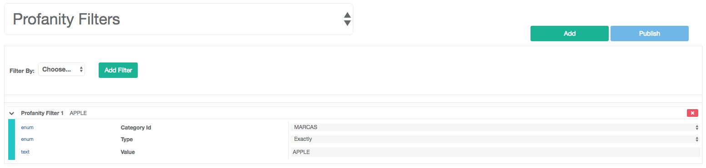

Introduction
============

Provides an interface to manage users and their devices. Also, collects useful
information and allows you to perform actions such as:

- Device login on to the game.
- Unified devices for social networking.
- Location by user device.
- Play session history.
- Banned users management.
- Resource management.
- Integration with other modules:
 - Achievements
 - Resources
 - Store
 - Issues
 - Inbox

Devices
-------
When you log into the game, devices send hardware and OS information to the server, linking it to a user through
an unique device id.

.. image:: images/devices.png

The information available is:

- *UUID*: Universal Unique Identifier.
- *Platform*: Operating system, such as: iOS, Android, Windows, Editor, etc.
- *Device Model*: Model of the mobile device, such as iPhone 6.
- *OS Version*: Operating system version.
- *Locale*: Current language selected on the mobile device.
- *Build*: The build number of the game that is currently playing the user.
- *Notification ID*: A unique code required by Google/Apple to send push notifications to the mobile device.
- *Quality*: The quality profile used by the device, uses a prior selected value or detects the best option automatically according to the hardware performance.
- *Timezone*: Timezone of the device.
- *Manifest*: Unity Cloudbuild information. 

.. image:: images/devices2.png

Social Networks
---------------
Devices that belong to a user and are connected to supported social networks like Google Play, Game Center or Facebook, send information to the server. This allows an user to login using any of his registered networks and continue with their prior game progress.

.. image:: images/social.png

Information stored is:
- *Social network*: Social network type.
- *NetworkId*: Unique user id on the social network.
- *Nickname*: Username in the social network.

Supported social networks:
 - Google Play
 - Game Center
 - Facebook

Session
-------
Each time the user starts the game, a connection is stablished with our server. We collect data related to this play session.

The country where the user is playing is tracked by IP address, allowing to group users by country or region. This information can be used for marketing purposes.

.. image:: images/session.png

The information stored into the sessions are:

- *LastUUID*: Unique id for the last device the user used.
- *Start Activity*: Time when the user started playing.
- *Last Activity*: Time when the user quitted the game.
- *LastIpAddress*: The last IP Address that logged.
- *LastCountry*: The last country the user played from.
- *LastBuild*: The last build version used.
- *LastTimezone*: The last timezone the user played from.

We can see a history of connections made during the game and from that device.

.. image:: images/session2.png

- *UUID*: UUID that logged.
- *Start Activity*: Time when you start login.
- *Last Activity*:  Time when you logout.
- *IpAddress*: IP Address that logged.
- *Country*: Country that logged.
- *Build*: Version of the build that start logged.
- *Timezone*: The last timezone that logged.

Resources
---------
Brainztorm allows resource management in a game with the ability to link these to users for easy handling. These can edit user resources in the game are registered by the resource module.

.. image:: images/resources.png

The fields in resources are:

- *Code*: Code to represent the resource.
- *Tags*: Tags to group the resources.
- *Amount*: Amount of the resource.
- *Maximum Amount*: Maximum amount of the resource.

Achievements
-------------
Brainztorm allows achievements management in a game with the ability to link these to users for easy handling.
These can edit user achievements in the game are registered by the achievements module.

PVP
----
Brainztorm can view the history of PVP (Player vs. Player) battles where registration enter conducted two have already registered users will see.

Inbox
------
Brainztorm offers the experience of being able to send notifications to users custom games or sending mass messages coming to your personal inbox.

Logs
-----
Brainztorm offers the experience of seeing a variety of logs for seguimineto errors in the game and to give more information to developers to fix them.

Store
-----
Brainztorm offers the experience to see products that can see each user as desired by the owners of the games and promotions criteria regions of the world.

Profanity Filter
----------------
Games should restrict by language words which are reserved or offensive that could cause a game to be closed or suspended. Brazintorm offers a profanity filter which allows feed and detect these words to avoid this mess by entering the name of a user or a game allowing chat easily avoid these legal problems.

Words can be categorized by language, to create / edit a group must enter "Profanity Category":

.. image:: images/profanity-category.png

The fields in profanity category are:

- *Name*: Name to represent the category. 
- *Locale*: Locale language. 

To add a filter to the profanity filter should enter "Profanity Filters" which allows the filling of those words in a specific group.

The fields in profanity filters are:

- *Category*: Category of the filter. 
- *Type*: The type to apply the filter.
- *Value*: Value of the filter. 

Words can be represented in different types which allow amicably say whether to search for the word at the beginning or end of a frace / word or that word exactly.

.. image:: images/profanity-filters-types.png

- *First*: It indicates that you should start with the set value. Example: Start with the word "Apple".
- *Last*: It indicates that you should end with the set value. Example: End with the word "Apple".
- *Exactly*: It indicates that you should exactly the value. Example: Exactly the word "Apple" without case sensitive.
- *Inverse First*: It indicates that you should start with the set value. Example: Start with the word "محمد".
- *Inverse First*: It indicates that you should end with the set value. Example: End with the word "محمد".
- *Inverse Exactly*: It indicates that you should exactly the value. Example: Exactly the word "محمد".
- *None*: It indicates that you should exactly the value. Example: Exactly the word "Apple" with case sensitive.

When updating your username Brainztorm reviews the list profanity filter and see if it is a word that meets the criteria administered:

Valid:

.. image:: images/sdk-profanity-true.png

Invalid:

.. image:: images/sdk-profanity-false.png
