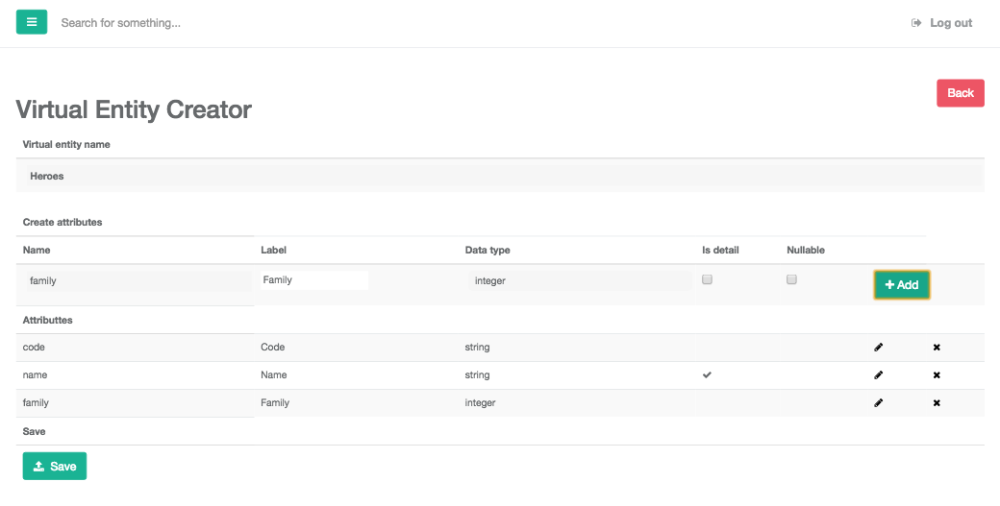
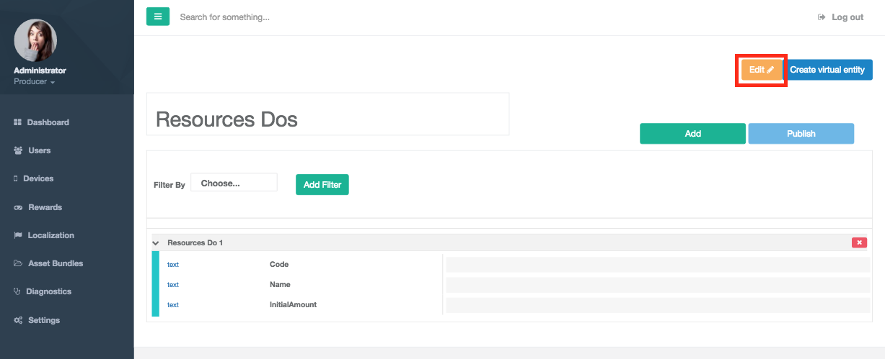

Virtual Entities
================

Introduction
------------

Provides an interface to manage structures (Virtual Entities) to manage information of the game, with this functionality you can create entities to manage parts of the games as for example heroes into the game providing a administration of the data by the client side, allowing to the game developer manage your own games data in minutes.

Create a new virtual entity
^^^^^^^^^^^^^^^^^^^^^^^^^^^

When you access to admin tools you can enter to the option "Settings", in this option you can manage the data of the entities created and create new virtual entities with structures disengaged to the game.

In this form you can see:

- *Virtual entity name*: Name of the new virtual entity.

- *Create Attributes* : Section to add new attributes in the virtual entity. You can add a new attribute addeding the following fields:

   - Name: Name of the attribute to manager.
   - Label: Label to show in variables system form.
   - Data type: Type to store the data this attribute.
    .. image:: images/data-types.png
   - Is detail: label to show in multiple records in the virtual entity data.
   - nullable: Allow to be null.
   
   
   When you add all data about the attribute you do click in button "Add" too append into list of attributes and save. 

- *Attributes*: Attributes or fields of the virtual entity.

Edit virtual entity
^^^^^^^^^^^^^^^^^^^^

When you access to variables system option in admin tools you can edit your virtual entities to define a new structure, to change you need is select your virtual entity and click on edit button to open again the form to create virtual entities with all your data loaded of the selected virtual entity.

