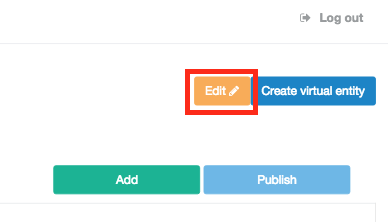

Virtual Entities
================

Introduction
------------

Provides an interface to manage structures (Virtual Entities) and the game data, taking advantage of this functionality, a developer can create entities to manage different aspects of the games, for example: heroes, spells, levels, progression, etc. It also allows clients to access, modify and retrieve data from the client, allowing the game developer manage their own data within minutes.

Create a new structure
^^^^^^^^^^^^^^^^^^^^^^

When accessing the admin tools under the option "Settings", a game developer can manage the structures data available and create new ones as needed:

.. image:: images/create-virtual-entity.png

In this form you can see:

- *Structure name*: Name of the structure

- *Create Attributes* : Section to add new attributes to the structure. You can add a new attribute using the following fields:

   - Name: Name of the attribute
   - Label: Label to name the structure in the "Settings" screen
   - Data type: Ensures the data has the required data type 
    .. image:: images/data-types.png
   - Is detail?: Label to easily
   - Nullable: Indicates whether the type can be null or not
   
When you fill the required fields in the form and then click "Add", this appends the attribute to the list and got saved.

- *Attributes*: Attributes or fields of the structure

Edit a structure
^^^^^^^^^^^^^^^^

When you access to the Variables System option in the Admin Tools, you can edit your structures to modify it as required, to change it what you need is select your structure and click on "Edit" to open the edition form showing all the existing attributes.

.. image:: images/create-virtual-entity.png
